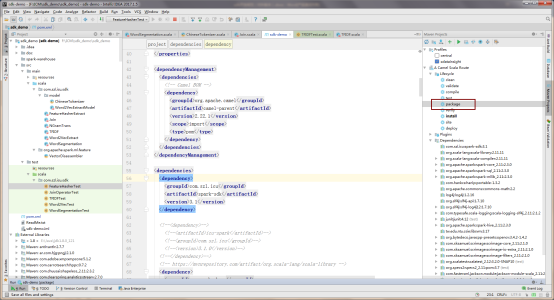
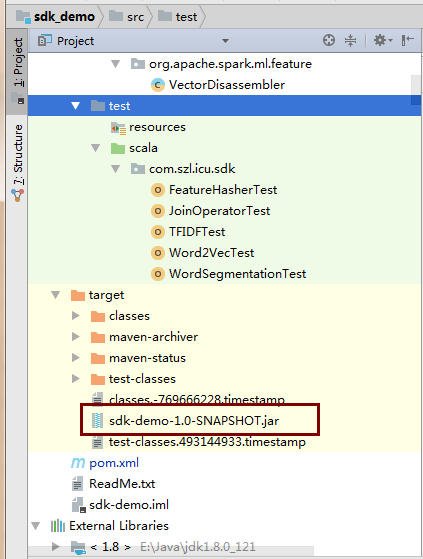

# 自定义算子打包

自定义算子打包，主要是要利用本地的集成开发工具，将编写好的算子打成jar包，方便后面将其上传至平台。现在一般的代码都是利用maven管理的，在IDEA环境下，打包示意图和打包后的jar包如下图所示。

​                                                                               自定义算子打包

