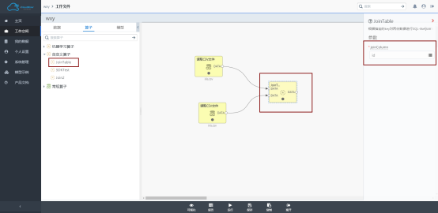

# 自定义算子拖拽式使用

用户可以在算子列表->自定义算子中找到相应算子，并通过拖拽的方式，将其拖入画布中，与其它算子组成工作流。使用示意图如下图所示

由图2-8可以看出，算子名称就是我们注册时的命名，算子的左边是我们在代码编写阶段定义的两个输入端口，右边是代码编写阶段定义的一个输出端口。双击算子后，页面右侧会显示参数joinColumn，这是我们在代码编写阶段，赋予joinKeys这个参数的名称。

至此，就完成了iClouldMiner的自定义算子开发。