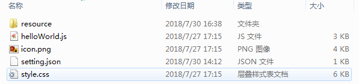
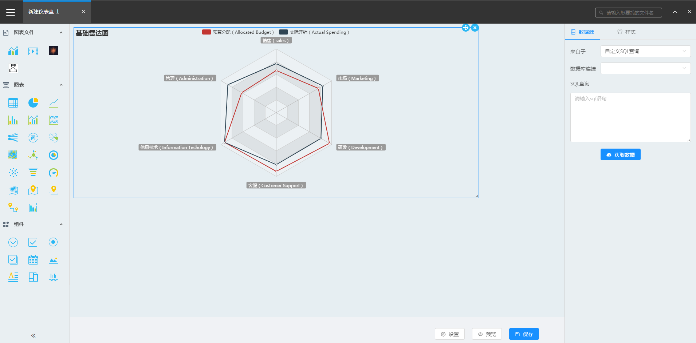
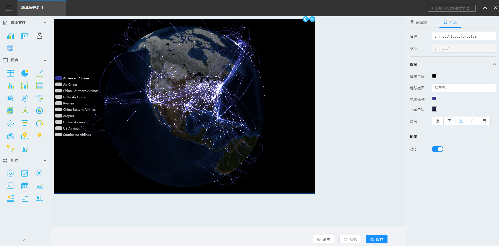

# 组件封装示例

&ensp; &ensp; &ensp;描述自定义组件开发步骤及过程，以组件helloWorld为例。

&ensp; &ensp; &ensp;该组件可以显示为一段文字内容，具有3个组件属性：文本内容、对齐方式和字体颜色。

<h2 id="开始">开始</h2>

+ **步骤1	新建文件夹helloWorld。**



+ **步骤2	在helloWorld文件夹下分别创建resource文件夹，以及文件setting.json、helloWorld.js、style.css，并将组件图标文件命名为icon.png放置在该文件夹下，如图：**

+ **步骤3	初始化文件内容：**

#### setting.json：

````javascript
{
    "type": "helloWorld",
    "name": "Hello World",
    "version": "1.0.0",
    "icon": {
        "type": "file",
        "fileName": "icon.png"
    }
}
````

#### style.css：

````css
/* 
* 组件样式文件
* style.css
*/
````

#### hellWorld.js：

````javascript
/**
* 组件主文件 hellWorld.js
* author：XXX
* create time:2018/7/30
*/
(function(){
    //从Dashboard中获取组件基类
    var widgetBase = window.Dashboard.widgetBase;
    //从Dashboard中获取jquery类库，并缓存
    var $ = window.Dashboard.lib.$;

    //定义组件类
    class HelloWorld extends widgetBase{
        constructor(htmlObj, cfg){
            super(htmlObj, cfg)
        }

        doQuery(cfg){
            super.doQuery(cfg);
        }

        queryFetched(data){
            super.queryFetched(data);
        }

        paramChanged(obj1){
            super.paramChanged(cfg);
        }   

        widgetWillCreated(cfg){
            super.widgetWillCreated(cfg);
        }

        widgetDidCreated(cfg){
            super.widgetDidCreated(cfg);
        }

        preUpdate(nextCfg){
            super.preUpdate(nextCfg);
        }

        postUpdate(nextCfg){
            super.postUpdate(nextCfg);
        }

        resize(){
            super.resize();
        }

        update(nextCfg){
            super.update(nextCfg);
        }

        draw(nextCfg){
            super.draw(nextCfg);
        }

        destroy(){
            super.destroy();
        }
    }

    //定义组件配置对象
    var config = {};

    var options = {
        widgetClass:HelloWorld,
        widgetConfig:config
    }

    //注册组件helloword
    window.Dashboard.register('helloWorld',options,true);
})();
````

<h2 id="构建组件配置项">构建组件配置项</h2>

补充helloWorld.js中config定义部分：

````javascript
/**
* 组件配置文件 
*/
var config = {
    /**
    * base          {Object}   基础配置
    * base.type     {String}   组件名称
    * base.group    {String}   组件所属分组
    * base.name     {String}   组件显示名称
    * base.version  {String}   组件版本号
    */
    base:{
        type:'helloWorld',
        name:'Hello World',
        group:'100'
    },
    /**
    * panel {Object} 组件配置面板配置
    * panel.dataSource    {Object}     数据源配置
    * panel.style         {Object}     样式配置
    */
    panel:{
        dataSource:{
            name: "数据源",
            //支持配置的数据源类型
            typeList: ['sql']
        },
        style:{
            name:'样式',
            /**
            * 面板组件配置
            */
            panelcfg:dataForPanel=>([
                {
                    name:'标题',
                    value:[
                        {
                            cname: "内容",
                            name: "text",
                            widget: "XInput",
                            disable: false,
                            visible: true
                        }
                    ]
                },
                {
                    name:'其他',
                    value:[
                        {
                            type: "string",
                            cname: "对齐方式",
                            name: "algin",
                            widget: "XRadio",
                            disable: false,
                            visible: true,
                            option: [
                                { name: "左", value: "left" },
                                { name: "中", value: "center" },
                                { name: "右", value: "right" }
                            ]
                        },
                        {
                            type: "string",
                            cname: "文本颜色",
                            name: "color",
                            widget: "XColorPicker",
                            disable: false,
                            visible: true,
                            option: [{ type: "normal" }]
                        }
                    ]
                }
            ]),
            //面板组件
            panelcmp: null
        }
    },
    /**
    * cfg {Function} 组件配置，组件初始化及主题切换时调用，生成组件属性
    * @param {Object} theme 主题对应属性
    * @return {Object} 基于主题生成的组件属性对象
    */
    cfg:(theme)=>{
        return {
            type: "helloWorld",
            name: "helloWorld",
            priority: 5,
            parameter: "",
            bigandsmall: true,
            executeAtStart: true,
            listeners: [],
            layout: {
                i: "",
                x: 0,
                y: 0,
                w: 3,
                h: 2,
                minW: 1,
                minH: 1,
                maxW: 12,
                moved: true
            },
            chartDefinition: {
                queryid: "",
                queryname: "",
                query: {
                    type: "",
                    param: {},
                    statement: "",
                    query: "",
                    jndi: ""
                },
                data: {},
                option: {
                    text:'Hello world!',
                    algin:'left',
                    color:'#666'
                },
                inject: {}
            }
        }
    },
    /**
    * 数据绑定配置配置信息
    * databind.dataset 数据集的绑定相关配置信息,支持如下属性
    * show {Boolean} 组件图标是否展示 默认true 
    * switch {Boolean} 是否可以切换至其他组件 默认true
    * iconClass {String} 组件图标如果展示，组件图标对应类名。对应类名需在样式文件中实现。规格为26X26。
    * cells {Array} 组件支持的字段框集合
    * cells[n] {Object} 单个字段框配置对象
    * cells[n].collectType: 0 不可汇总 1 必须汇总 2 可汇总
    * cells[n].min 格子最少字段数量
    * cells[n].max 格子最多字段数量
    * cells[n].valid(len,lenArr) 格子内字段情况验证 len{Number}: 当前格子包含的字段数量 lenArr{Aray}: 当前格子组的字段数集合
    * allowFieldTypes {Array} 格子可接收字段的类型集合，如果不设置该字段则表示该格子不限制拖入字段的类型
    */
    databind:{
        dataset:{
            show: false,
            switch: false,
            iconClass: "layout-helloWorld",
            cells: [
                {
                    title: "字段",
                    valueKey: "datas",
                    max:1,
                    min:1,
                    collectType: {
                        defaultValue: 0,
                        selectValue: 2
                    }
                }
            ]
        }
    }
};
````

>说明：

>1、base中配置组件基本信息，需和helloWorld中对应，其中group为分组信息，仪表盘组件分为三个组：图表文件、图表和组件，其groupId分别为100、101、102，请根据实际需要配置。

>2、panel中配置右侧面板对应配置项。datSource为数据源配置项。style为样式配置项，panelcfg中配置哪些组件属性可以在配置面板-样式中配置，这里示例组件列举了三个组件属性：1、文本内容(text) 2、对齐方式(algin) 3、字体颜色(color)。

>3、cfg类型为Function，当前主题样式对象将被作为参数传入，该函数在组件初始化或主题切换的时候会被调用，其返回值将作为组件初始化cfg。组件cfg对象结构参见API章节。

>4、panelcfg中每项配置中widget指配置项需要用何种类型配置组件展示，系统内置配置组件如下表所示：

| 组件名称 | 描述 | option配置示例 |
| :------| :------ | :------ |
| XColorPicker | 颜色选择器 | [{ type: "listColor" }] |
| XIconPicker | 图标选择 | [{icon: bike, value: 'fa fa-bicycle', name: '自行车'},…] |
| XInput | 输入框 | null |
| XRadio | 单选 | [{name:'上',value:'top'},...] |
| XSelect | 下拉选择 | [{name:'上',value:'top'},...] |
| XSlider | 滑块选择 | [{ maxRange: 50, minRange: 1, tipFormatter: "%" }] |
| XSwitch | 开关 | null |
| XRadioGroup | 单选组 | [{name:'上',value:'top'},...] |
| XRadioInput | 带自定义单选 | [{name:'关',value:'auto',defaultValue: 'auto'},{name:'开',name2: '',value:0,defaultValue: 10}] |
| XDate | 日期选择 | null |
| XCodeEditor | 代码编辑 | [{type: 'javascript'}] |
| XRadioGroupInput | 带自定义单选组 | [{"name":"无","value":"auto","defaultValue":"auto"},{"name":"平均","value":"average","defaultValue":"average"},{"name":"定值","name2":"","value":0,"defaultValue":0}] |
| XFileSrc | 文件选择 | {"src":"/xDataInsight/api/repo/files/tree?filter=*.jpg|*.png|*.gif|*.bmp&_=1389042244770","type":"image"} |

<h2 id="封装组件类">封装组件类</h2>


组件继承至基类。

在初始化时候可以在widgetDidCreated中对组件自身DOM结构进行构建和缓存：

````javascript
widgetDidCreated(cfg){
    super.widgetDidCreated(cfg);
    this.$dom = $(
        '<div class="custom-helloword">\
            <div class="custom-helloword-title"></div>\
            <div class="custom-helloword-content"></div>\
        </div>'
    )
    this.$dom.appendTo(this.htmlObj);
    this.$title = $('.custom-helloword-title',this.$dom);
    this.$content = $('.custom-helloword-content',this.$dom);
}
````

当组件属性值变化时，我们可以在draw方法中对变化的属性值做出相应：

````javascript
draw(nextCfg){
    super.draw(nextCfg);
    if(nextCfg){
        var option;
        var data;

        if(nextCfg.option){
            option = nextCfg.option
        }else if(nextCfg.chartDefinition && nextCfg.chartDefinition.option){
            option = nextCfg.chartDefinition.option
        }

        if(nextCfg.data){
            data = nextCfg.data;
        }else if(nextCfg.chartDefinition && nextCfg.chartDefinition.data){
            data = nextCfg.chartDefinition.data;
        }

        if(option){
            for(let key in option){
                this.option(key,option[key]);
            }
        }

        if(data){
            this.option('data',data);
        }
    }
}
````

其中option方法需在组件类中新增，内容如下：

````javascript
option(key,value){
    switch(key){
        case 'text':
        this.$title.text(value);
        break;
        case 'color':
        $(this.htmlObj).css('color',value);
        break;
        case 'algin':
        $(this.htmlObj).css('text-align',value);
        break;
        case 'data':
        this._handleData();
        break;
    }
}
````

其中_handleData为数据处理部分，方法需在组件类中新增，内容如下：
````javascript
_handleData(){
    var data = this.cfg.chartDefinition.data;
    var dataLen = 0;

    if(data && data.resultset){
        dataLen = data.resultset.length;
    }
    
    this.$content.text('共查询了'+ dataLen +'条数据');
}
````

完整的helloWorld.js内容如下：
````javascript
/**
* 组件主文件 hellWorld.js
* author：XXX
* create time:2018/7/30
*/
(function(){
    //从Dashboard中获取组件基类
    var widgetBase = window.Dashboard.widgetBase;
    //从Dashboard中获取jquery类库，并缓存
    var $ = window.Dashboard.lib.$;

    //定义组件类
    class HelloWorld extends widgetBase{
        constructor(htmlObj, cfg){
            super(htmlObj, cfg);
        }

        doQuery(cfg){
            super.doQuery(cfg);
        }

        queryFetched(data){
            super.queryFetched(data);
        }

        paramChanged(obj1){
            super.paramChanged(cfg);
        }   

        widgetWillCreated(cfg){
            super.widgetWillCreated(cfg);
        }

        widgetDidCreated(cfg){
            super.widgetDidCreated(cfg);
            this.$dom = $(
                '<div class="custom-helloword">\
                    <div class="custom-helloword-title"></div>\
                    <div class="custom-helloword-content"></div>\
                </div>'
            )
            this.$dom.appendTo(this.htmlObj);
            this.$title = $('.custom-helloword-title',this.$dom);
            this.$content = $('.custom-helloword-content',this.$dom);
        }

        preUpdate(nextCfg){
            super.preUpdate(nextCfg);
        }

        postUpdate(nextCfg){
            super.postUpdate(nextCfg);
        }

        resize(){
            super.resize();
        }

        update(nextCfg){
            super.update(nextCfg);

            //数据处理
            if( nextCfg.data ){
                //code...
                this._handleData();
            }
        }

        _handleData(){
            var data = this.cfg.chartDefinition.data;
            var dataLen = 0;

            if(data && data.resultset){
                dataLen = data.resultset.length;
            }
            
            this.$content.text('共查询了'+ dataLen +'条数据');
        }

        draw(nextCfg){
            super.draw(nextCfg);
            if(nextCfg){
                var option;
                var data;

                if(nextCfg.option){
                    option = nextCfg.option
                }else if(nextCfg.chartDefinition && nextCfg.chartDefinition.option){
                    option = nextCfg.chartDefinition.option
                }

                if(nextCfg.data){
                    data = nextCfg.data;
                }else if(nextCfg.chartDefinition && nextCfg.chartDefinition.data){
                    data = nextCfg.chartDefinition.data;
                }

                if(option){
                    for(let key in option){
                        this.option(key,option[key]);
                    }
                }

                if(data){
                    this.option('data',data);
                }
            }
        }

        option(key,value){
            switch(key){
                case 'text':
                this.$title.text(value);
                break;
                case 'color':
                $(this.htmlObj).css('color',value);
                break;
                case 'algin':
                $(this.htmlObj).css('text-align',value);
                break;
                case 'data':
                this._handleData();
                break;
            }
        }

        destroy(){
            super.destroy();
        }
    }

    /**
    * 组件配置文件 
    */
    const config = {
        /**
        * base          {Object}   基础配置
        * base.type     {String}   组件名称
        * base.group    {String}   组件所属分组
        * base.name     {String}   组件显示名称
        * base.version  {String}   组件版本号
        */
        base:{
            type:'helloWorld',
            name:'Hello World',
            group:'100'
        },
        /**
        * panel {Object} 组件配置面板配置
        * panel.dataSource    {Object}     数据源配置
        * panel.style         {Object}     样式配置
        */
        panel:{
            dataSource:{
                name: "数据源",
                //支持配置的数据源类型
                typeList: ['sql']
            },
            style:{
                name:'样式',
                /**
                * 面板组件配置
                */
                panelcfg:dataForPanel=>([
                    {
                        name:'标题',
                        value:[
                            {
                                cname: "内容",
                                name: "text",
                                widget: "XInput",
                                disable: false,
                                visible: true
                            }
                        ]
                    },
                    {
                        name:'其他',
                        value:[
                            {
                                type: "string",
                                cname: "对齐方式",
                                name: "algin",
                                widget: "XRadio",
                                disable: false,
                                visible: true,
                                option: [
                                    { name: "左", value: "left" },
                                    { name: "中", value: "center" },
                                    { name: "右", value: "right" }
                                ]
                            },
                            {
                                type: "string",
                                cname: "文本颜色",
                                name: "color",
                                widget: "XColorPicker",
                                disable: false,
                                visible: true,
                                option: [{ type: "normal" }]
                            }
                        ]
                    }
                ]),
                //面板组件
                panelcmp: null
            }
        },
        /**
        * cfg {Function} 组件配置，组件初始化及主题切换时调用，生成组件属性
        * @param {Object} theme 主题对应属性
        * @return {Object} 基于主题生成的组件属性对象
        */
        cfg:(theme)=>{
            return {
                type: "helloWorld",
                name: "helloWorld",
                priority: 5,
                parameter: "",
                bigandsmall: true,
                executeAtStart: true,
                listeners: [],
                layout: {
                    i: "",
                    x: 0,
                    y: 0,
                    w: 3,
                    h: 2,
                    minW: 1,
                    minH: 1,
                    maxW: 12,
                    moved: true
                },
                chartDefinition: {
                    queryid: "",
                    queryname: "",
                    query: {
                        type: "",
                        param: {},
                        statement: "",
                        query: "",
                        jndi: ""
                    },
                    data: {},
                    option: {
                        text:'Hello world!',
                        algin:'left',
                        color:'#666'
                    },
                    inject: {}
                }
            }
        },
        /**
         * 数据绑定配置
         */
        databind:{
            dataset:{
                iconClass: "layout-helloWorld",
                cells: [
                    {
                        title: "字段",
                        valueKey: "datas",
                        max:1,
                        min:1,
                        collectType: {
                            defaultValue: 0,
                            selectValue: 2
                        }
                    }
                ]
            }
        }
    };

    var options = {
        widgetClass:HelloWorld,
        widgetConfig:config
    }

    //注册组件helloword
    window.Dashboard.register('helloWorld',options,true);
})();
````

至此，组件创建完成。

<h2 id="测试组件">测试组件</h2>

+ **步骤1 创建html文件，并引入SDK和组件主js文件及样式文件。如下：**

````html
<!DOCTYPE html>
<html>
<head>
    <meta charset="UTF-8">
    <meta name="viewport" content="width=device-width, initial-scale=1.0">
    <meta http-equiv="X-UA-Compatible" content="IE=edge">
    <title>test</title>
    <link rel="stylesheet" href="./sdk/styles.css">
    <link rel="stylesheet" href="./helloWorld/style.css">
    <style>
        #div1{
            width: 100px;
            height: 100px;
        }
    </style>
</head>
<body>
    <div id="div1"></div>
    <script src="./sdk/dashboard.core.js"></script>
    <script src="./helloWorld/helloWorld.js"></script>
    <script>
        var _Dashbord = window.Dashbord;
        var $ = _Dashbord.lib.$;
        _Dashbord.bootstrap().then(function(){
            var ins = _Dashbord.add({
                cfg:{
                    type:'helloWorld'
                },
                htmlObj:$('#div1')[0]
            })
        });
    </script>
</body>
</html>
````

+ **步骤2 浏览器中打开该html文件，观察组件是否正常展示。**


<h2 id="其他案例">其他案例</h2>

&ensp; &ensp;&ensp;上述通过简单实例阐述了自定义组件开发过程。按照自定义组件开发规范，我们可以按需扩充仪表盘既有组件。如没有的图表等。

+ **雷达图**



+ **3D Globe**

