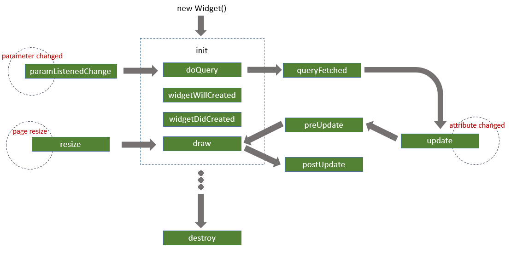

# 自定义组件开发规范

&ensp; &ensp;&ensp;用户可以开发自定义组件，上传到xDataInsight平台文件系统对应目录中。Dashboard初始化时会自动读取对应文件目录中的所有自定义组件包，自定义组件加载成功后，用户可以在仪表盘中使用这些组件构建和配置页面。

&ensp; &ensp;&ensp;组件开发需要遵循自定义组件开发规范，否则无法被平台识别和加载。

<h2 id="目录结构">目录结构</h2>

├─ helloWorld

├─   ├─ resource

├─   ├─ setting.json

├─   ├─ helloWorld.js

├─   ├─ style.css

├─   ├─ icon.png

>说明：

>如果是在node环境下开发组件，打包后需保持以上目录结构。

<h2 id="文件/文件夹说明">文件/文件夹说明：</h2>

+ **helloWorld文件夹**

    组件主文件夹。文件夹名称要求用组件名称命名，且该名称不能重复。

+ **resource文件夹**

    组件包的资源文件夹目录，可以放图片、字体等资源。

+ **setting.json文件**

    组件说明：文件。

````javascript
{
    "type": "helloWorld",
    "name": "Hello World",
    "version": "1.0.0",
    "icon": {
        "type": "file",
        "fileName": "icon.png"
    }
}
````

+ **helloWorld.js文件**

    组件主js文件，包含组件类定义、配置信息声明和组件注册。

````javascript
/**
* 组件主文件
* author：XXX
* create time:
*/
(function(){
    //从Dashboard中获取组件基类
    var widgetBase = window.Dashboard.widgetBase;

    //定义组件类
    class HelloWorld extends widgetBase{
        constructor(htmlObj, cfg){
            super(htmlObj, cfg)
        }
    }

    //配置信息声明
    var config = {};

    var options = {
        widgetClass:widget,
        widgetConfig:config
    }

    //注册组件
    window.Dashboard.register("helloWorld",options,true);
})();
````
>说明：

>如果文件中用到ES6语法，需要通过 [babel](https://www.babeljs.cn/) 等工具对内容进行转换。

+ **style.css文件**

    组件样式文件。

>说明：

>自定义组件样式选择器需要遵循命名方式cunstom-<name>-[XXX]。比如组件如果为helloWorld，其css选择器可以为： cunstom-helloWorld-XXX 、cunstom-helloWorld ul等。

+ **icon.png文件**

    组件图标文件，建议尺寸大小为26px X 26px。
    
    <h2 id="组件生命周期及钩子函数">组件生命周期及钩子函数</h2>

&ensp; &ensp; &ensp;组件生命周期及钩子函数，如下图所示：


    