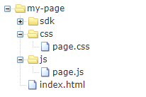
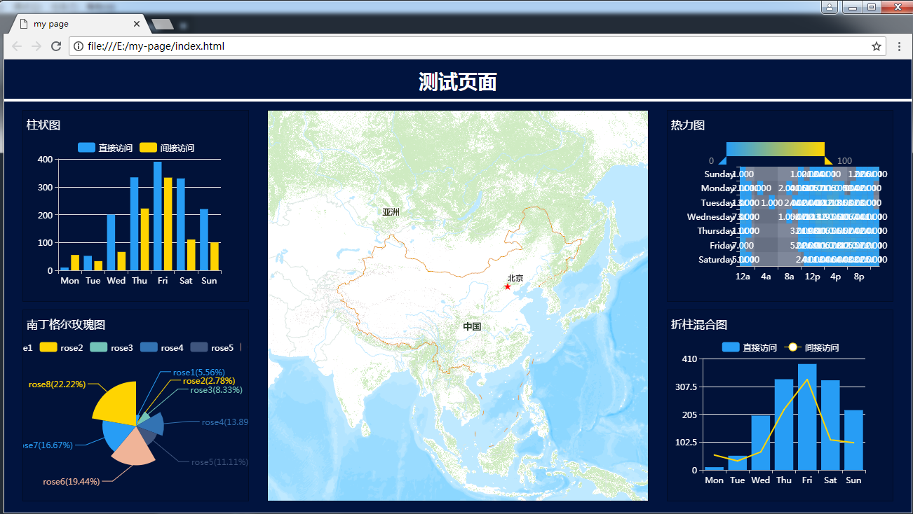

# 页面开发示例

&ensp; &ensp; &ensp;描述如何通过SDK进行页面开发。SDK包内置仪表盘组件。其对应关系如下表所示：

| 组件名称 | Type | 组件名称 | Type |
| :----- | :----- | :----- | :----- |
| 下拉框 | select | 饼图 | chartPie |
| 自定义图表 | custom | 多维 | olap |
| 多选框 | checkbox | 单选框 | radio |
| 日期 | date | 文本 | text |
| 热力地图 | heatMap | 标记地图 | markerMap |
| 路线地图 | routeMap | 迁徙地图 | migrateMap |
| 视频 | video | 折线图 | chartLine |
| 柱状图 | chartBar | 折柱混合图 | chartMix |
| 容器 | container | 表格 | table |
| 多选下拉 | multiselect | 图片 | pictcomponent  |
| 指标点阵图 | chartDot | 河流图 | themeriver |
| 桑基图 | sankey | 南丁格尔玫瑰图 | chartRose |
| 热力图 | heatchart | 词云图 | chartWordCloud |
| 关系关联图 | graph | 嵌套环形图 | chartNestpie |
| 漏斗图 | chartFunnel | 油量图 | chartGauge |
| 动态数轴 | timeline | | |

<h2 id="创建页面工程">创建页面工程</h2>

+ **步骤1	 本地新建目录my-page，my-page下分别创建文件夹js、css、sdk及文件index.html，js和css文件夹下分别创建page.js和page.css，如下图：**



+ **步骤2	 将sdk包拷贝至sdk目录中。**

+ **步骤3	 页面工程创建完毕。**

>说明：

>页面工程具体结构根据实际可能不同，这里只是举例。

<h2 id="编写页面布局和逻辑">编写页面布局和逻辑</h2>

+ **步骤1 编辑index.html页面，引用各js和css文件。并根据业务需要编写页面布局。**

````html
/* index.html */
<html>
    <head>
        <meta charset="UTF-8">
        <meta http-equiv="X-UA-Compatible" content="IE=edge,chrome=1"> 
        <meta name="viewport" content="width=device-width, initial-scale=1.0">
        <title>test</title>
        <link rel="stylesheet" type="text/css" href="./sdk/styles.css">
        <link rel="stylesheet" type="text/css" href="./css/page.css">
    </head>
    <body>
        <div class="page-title">测试页面</div>
        <div class="page-charts">
            <div id="chart1" class="page-chart"></div>
            <div id="chart2" class="page-chart"></div>
            <div id="chart3" class="page-chart"></div>
            <div id="chart4" class="page-chart"></div>
            <div id="chart5" class="page-chart"></div>
        </div>
    </body>
    <script src="./sdk/dashboard.core.js"></script>
    <script src="./page/page.js"></script>
</html>
````

+ **步骤2 在page.css添加页面对应各样式。**

````css
/* 页面css */
body{
    width:100%;
    height: 100%;
    background-color: #01143f;
}
.page-title{
    height: 60px;
    line-height: 60px;
    color: #fff;
    text-align: center;
    font-size: 28px;
    font-weight: bold;
    font-family: 微软雅黑;
    border-bottom: 4px #fff solid;
}
.page-charts{
    height: calc(100% - 64px);
    position: relative;
}
.page-chart{
    border: 1px rgba(0,0,0,0.4) solid;
    position: absolute;
}
#chart1{
    width: 25%;
    height: 47%;
    left: 2%;
    top: 2%;
}
#chart2{
    width: 25%;
    height: 47%;
    right: 2%;
    top: 2%;
}
#chart3{
    width: 25%;
    height: 47%;
    bottom: 2%;
    left: 2%;
}
#chart4{
    width: 25%;
    height: 47%;
    right: 2%;
    bottom: 2%;
}
#chart5{
    top: 2%;
    left:29%;
    width: 42%;
    height: 96%;
}
````

+ **步骤3 在page.js中增加页面逻辑。通过调用SDK API对页面进行组件填充。**

````javascript
/**
* 页面js
*/
(function(window,undefined){
    var Dashboard = window.Dashboard;
    var lib = Dashboard.lib;
    var $ = lib.$;
    var _ = lib._;

    window.Dashboard.bootstrap().then(function(){
        var theme = Dashboard.globalParam.globalParam.theme;
        var ins1, ins2, ins3, ins4, ins5;

        $.extend(true,Dashboard.globalParam.globalParam.theme,{
            chart:{
                backgroundColor:'rgba(0,0,0,0.1)',
                textColor:['#fff','#fff']
            }
        });

        Dashboard.add({
            cfg:{
                type: "chartBar"
            },
            htmlObj: $('#chart1')[0]
        }).then(function(ins){
            debugger
            ins1 = ins;
        });

        Dashboard.add({
            cfg:{
                type: "heatchart"
            },
            htmlObj: $('#chart2')[0]
        }).then(function(ins){
            ins2 = ins;
        });

        Dashboard.add({
            cfg:{
                type: "chartRose"
            },
            htmlObj: $('#chart3')[0]
        }).then(function(ins){
            ins3 = ins;
        });

        Dashboard.add({
            cfg:{
                type: "chartMix"
            },
            htmlObj: $('#chart4')[0]
        }).then(function(ins){
            ins4 = ins;
        });

        Dashboard.add({
            cfg:{
                type: "heatMap"
            },
            htmlObj: $('#chart5')[0]
        }).then(function(ins){
            ins5 = ins;
        });

        //resize
        $(window).resize(function(){
            ins1 && ins1.echartsDom.resize();
            ins2 && ins2.echartsDom.resize();
            ins3 && ins3.echartsDom.resize();
            ins4 && ins4.echartsDom.resize();
            ins5 && ins5.echartsDom.resize();
        }); 
    });

})(this);
````

<h2 id="查看页面">查看页面</h2>

&ensp; &ensp; &ensp;将index.html页面在浏览器中打开，可查看实际效果，如图：

