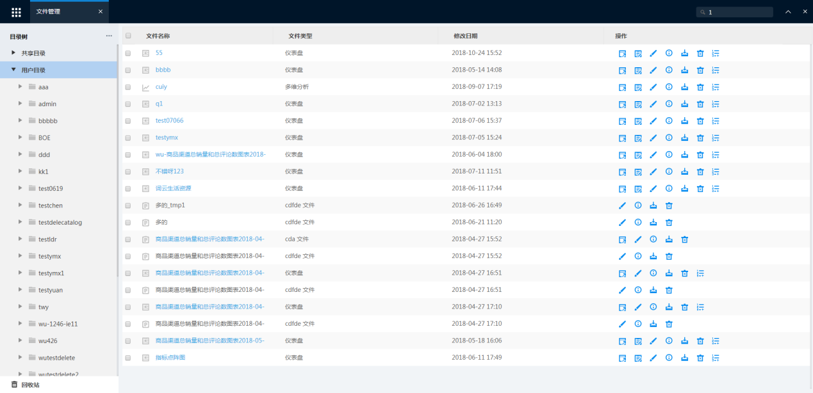
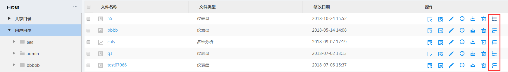
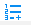
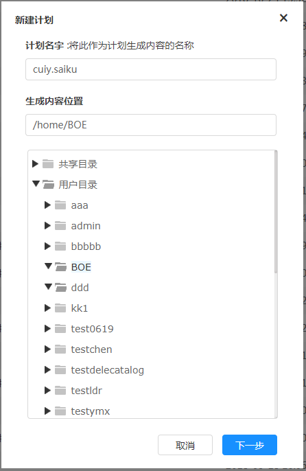
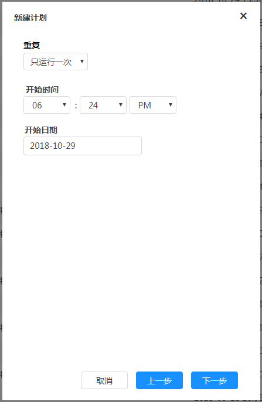
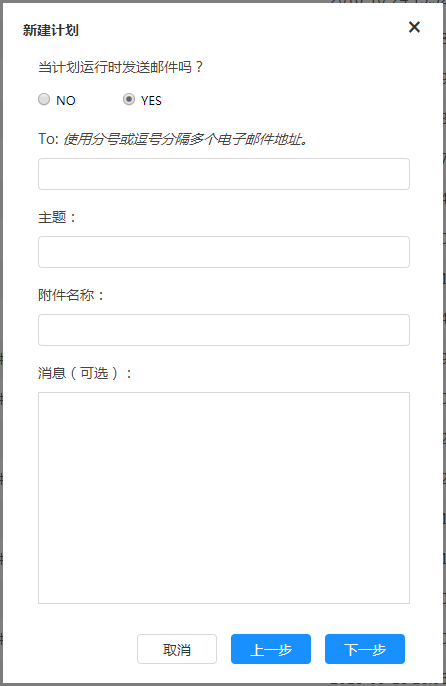
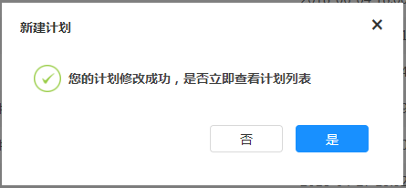
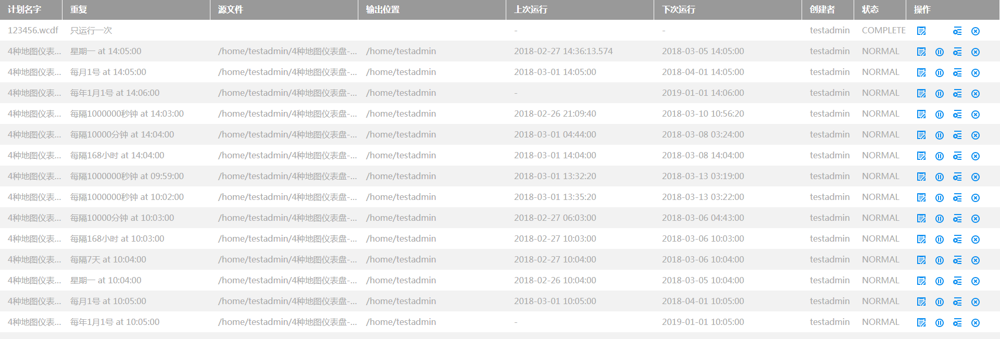

# 任务计划

xDataInsight平台可以定时运行计划任务，在指定的时间周期内运行多维分析、即席查询、仪表盘等类型的报表，并将结果存储到指定的位置或发送邮件

### 添加任务计划

在导航菜单栏选择“文件管理”，弹出如图

选择“共享目录”或者“用户目录”下的选择目标文件夹，对多维分析、定制报表、仪表盘等文件类型可以进行任务计划操作，选择如下图所示的新建任务计划快捷键

点击快捷键，弹出对应的“新建计划”对话框，如图所示。对计划名称进行编辑，选择计划生成的内容位置

点击“下一步”进入如下图所示的设置页面。设置计划的重复周期、开始时间及开始日期

点击“下一步”按钮，选择计划运行时是否发送邮件。选择“Yes”，输入需要发送的邮件地址、邮件主题、附件名称及消息等，如图所示。

点击“下一步”按钮，确定是否查看计划列表，如图

### 管理任务计划

要管理任务计划，在导航菜单中点击“设置”菜单下的“任务计划”，弹出如图

