# 制作仪表盘

点击主菜单 =>分析与报表 =>新建仪表盘，打开仪表盘设计器，如下图3.6-1所示（也可以导航页点击敏捷仪表盘快速进入）。

仪表盘设计器界面中，左侧面板为工具箱，主要包括各种布局容器、图表和组件，右侧面板为属性面板，中间的大片空白面板为仪表盘设计画布。

### 添加图表

在左侧图表工具箱中找到柱状图并拖动到画布当中，弹出图表数据绑定界面

图表数据绑定界面，分为以下几个部分：

1. 数据集展示区

2. 图表数据绑定区

3. 图表预览区

4. 图表工具条

5. 数据限制开关

要通过数据集获取数据并简单制作一个图表，操作步骤如下：

1. 点击左上角业务数据集右侧的按钮，在弹出的菜单中选择一个数据集，下方展示该数据集中的所有字段，并按数据集中的设置分组展示

拖动字段到图表数据绑定区对应的数据框中。当所有必须的数据框都拖入了合适的字段后，将立即获取数据，图表被立即渲染出来。如图所示，分别拖动一个字段到x轴和y轴框中，柱状图立即被渲染出来。

点击右上角的完成按钮，返回上级报表设计画布界面。右侧样式面板中可进行图表样式设置，画布中的图表将即时反应样式的改变

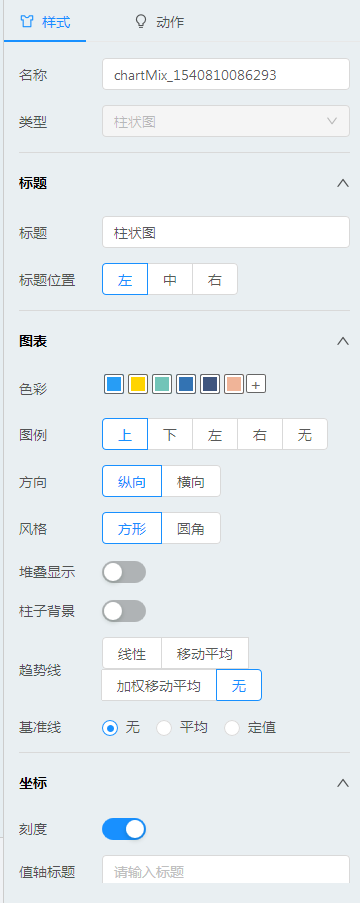

右侧的动作面板中，可设置图表的下钻（部分图表支持）和交互操作。设置为下钻时，用户需要拖动多个字段到类别或x轴数据框中，但图表只会使用第一个字段来汇总数据，当点击图表的一个区域时，再使用第二个字段来汇总数据（以点击区域的数据作为查询条件）。设置为交互时，可将点击区域的数据存储到参数当中，其它图表在筛选条件中使用该参数来筛选数据

鼠标放置到图表上时，右上角会显示刷新和导出图片图标，如果在样式面板中打开了导出数据开关，还可以看到导出数据按钮。在运行状态下，还可以点击图表右上角的按钮将图表放大至整个浏览器窗口，以提供更清晰的展示。

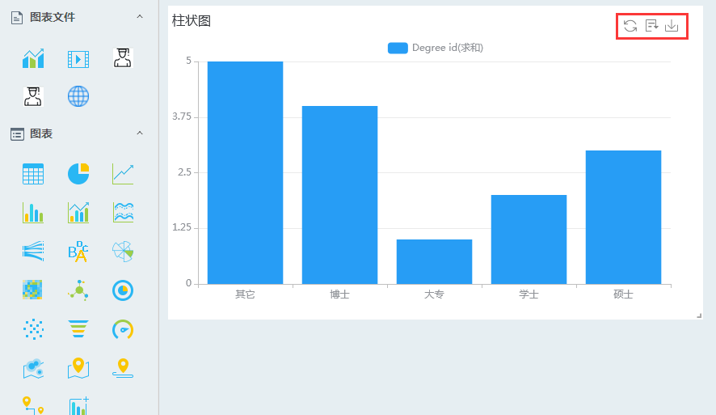

### 图表数据获取

#### 数据集的选择与切换

每个图表只能从一个数据集中获取数据，仪表盘首次为图表绑定数据时，必须手动选择一个数据集，后续将默认使用上次使用的数据集。

没有选择数据集时，点击左上角业务数据集右侧的按钮选择一个业务数据集；如果已经选择了一个业务数据集，按钮将变为按钮，点击切换业务数据集。切换数据集之后，下方立即显示选择的数据集中的字段

#### 图表数据绑定

每种图表均有自己的数据绑定框，随着图表类型的切换而变化，每个框中能够放置多少个字段，数据框中均有提示。

不同的数据框对数据处理的方式不同，例如，柱状图要求x轴为维度，y轴为分析指标，对x轴维度可以进行排序和修改显示名称的操作，对y轴指标除可排序和改名外，还可以进行汇总、同/环比计算、排名计算、以及设置数据显示格式等更复杂的计算操作。

不同类型的字段均可拖入数据框中，如果拖入了字符串或日期类型的字段到指标框中（如柱状图的y轴），将会使用计数来汇总数据，形成可分析的数值型指标。

#### 数据过滤

数据需要过滤数据时，拖动一个字段到筛选框，立即会弹出数据筛选框，可进行勾选或条件筛选。进行条件筛选时，可选择使用参数，通过参数传递查询条件，实现图表联动

#### 图表切换

点击上方的图表工具条可随时切换图表，系统会判断原来放置的数据是否能够用于渲染新的图表，如果数据可以用于渲染新图表，则立即渲染新图表，否则需人工调节数据的绑定之后才可以渲染新图表

#### 数据汇总

如果数据框要求数据汇总，如柱状图的y轴，饼图的指标等，则拖入框中的字段将默认采用求和汇总，用户可以点击字段右侧的符号修改汇总方式，包括平均、最大值、最小值、计数、方差、标准差等。如果拖入字符串类型的字段到数据框中，将默认采用计数的汇总方式，同时其它汇总方式不可用。

如果数据框不允许汇总，点击右侧的符号，将看不到汇总的菜单项。如图所示。如果拖动到数据框中的数据为使用了汇总函数的计算字段，则所有的汇总方法为灰色。

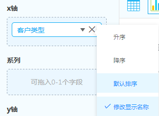

#### 同/环比计算

系统支持同/环比计算和排名计算，进行同比计算时需数据框中必须有一个带粒度的日期字段，如年、季度、月等。

数据集中的日期字段，将被自动解析为年（年月）、季度（年季度）、月（年月）、周（年周）、日（年月日）、时、分、秒等粒度。进行同/环比计算时，需先拖动一个日期粒度到数据框中，再对要计算同环比的指标设计汇总方式，最后才能设置同/环比计算

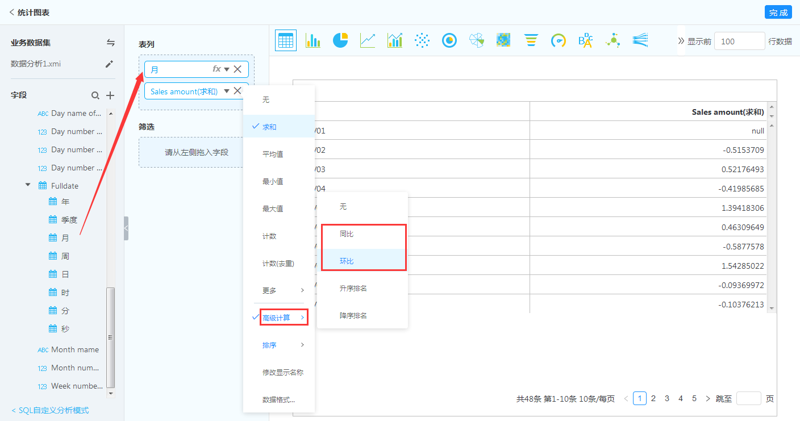

如果数据框中未发现带粒度的日期字段，选择同/环比计算时，会提示错误

如果从数据框中删除了一个带粒度的日期字段，此时又有指标进行同环比计算，同样会弹出图3.6.2-6中的错误，并且同环比无法被计算，数据获取失败

#### 排名计算

要对一个字段进行排名计算，点击该字段右侧的符号，选择高级计算 > 升序排名或降序排名即可。对于数值型字段，将会对该字段中所有的数据进行大小比较并进行排名，返回从1开始的序列；对于其它字符串型字段，会按字符串进行排序，并进行排名。

#### 数据格式

对于数值类型的指标数据，可以设置数据格式。点击字段右侧的三角符号，弹出的菜单中选择数据格式，弹出数据格式对话框，可对数据的千分位分隔符、小数位数、数量级等进行设置

#### 计算字段

有些数据不能直接从数据集中获取，而需要通过计算间接查询出来。点击字段区右上角的新增计算字段，打开新增计算字段对话框。

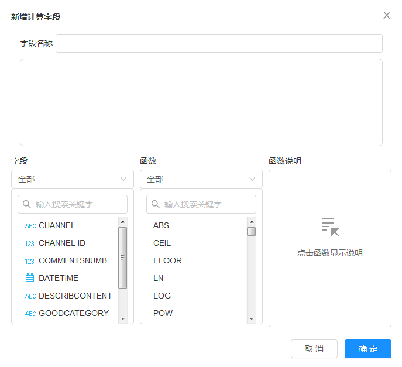

对话框中，上方输入计算字段的名称及计算公式，下方列出了可用的字段和计算函数，点击选择一个函数，可以查看函数的使用方法。鼠标指向一个字段或者函数时，其右侧出现“插入”信息，点击可将字段或函数名填入上方输入框的光标位置。使用此方法可以避免手动输入任何代码编写出复杂的计算公式。

公式中使用的字符串需要使用英文双引号引起来，除使用函数来完成计算以外，还支持以下计算符号：加（+）、减（－）、乘（*）、除（/）、除法余数（%）。

如果在计算字段中使用了汇总函数，则公式中所有使用的字段都必须使用汇总函数，否则数据将无法计算正确结果，同时汇总函数不支持嵌套，但其它的函数都支持嵌套使用。使用了汇总函数的计算字段在使用时，将不能再次选择使用汇总方式。

#### 定义SQL查询

除通过业务数据集获取数据外，还可以通过编写灵活的SQL语句来实现数据的更灵活的查询获取。

要使用自定义SQL查询，在数据绑定界面，点击左下角的链接，切换到SQL查询模式。

数据库连接：选择一个JDBC数据库连接。

SQL查询：编写自己的SQL查询语句，该查询语句将会支持发送到对应的数据库中查询，返回的数据将会用于渲染图表。查询中还可传入参数来查询数据，点击“+ 插入参数”按钮，选择一个参数，将会把参数插入到SQL语句的光标当前位置。

不同的图表对SQL查询语句返回的数据有不同的要求，后面对每个图表的数据要求分别做说明。

### 图表设置

图表设置包括三个方面：

数据源：图表的数据获取方式，前面的章节已经介绍了通过数据集获取数据，下面的章节将介绍使用SQL语句时获取数据时，每种图表对数据的格式要求。

样式：图表的样式设置。

动作：图表的交互动作。

下面对每种图表进行单独说明。

#### 柱状图

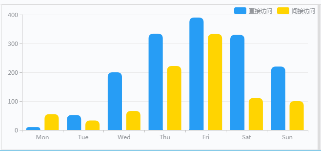

1）SQL数据源

SQL查询查询语句和结果示例如下：

SELECT

​	cast(LEFT(date_id, 4) as char) as '年',

​	cast(substr(date_id,5,2) as char) as '月',

​	sum(sales_num) as '销量',

​	sum(sales_amount) as '销售额'

FROM

​	fact_product_sale

GROUP BY

​	LEFT (date_id, 4) ,substr(date_id,5,2)

点击获取数据，柱状图即按照查询结果渲染

说明：查询结果字段分为两部分，即维度和指标，维度的数据类型请使用字符串，指标的数据类型请使用数值（如果不按照此约定处理，查询结果在图中会出现异常）。在柱状图中，横轴表示维度，纵轴表示指标。若维度为多个，默认会用符号连接起来显示（可以通过改变点击事件来控制维度显示，将在“动作”小节进行说明），若指标为多个，每一个维度上会按照指标显示多根柱子（如上图所示）。

​	参数查询：设置参数默认值，参数可以在SQL查询中以${para0}格式引用，例如select ${para0} from dual。注意：参数默认为字符串型，如果需要使用数值型，可以在设置=>管理参数=>参数列表=>类型中进行设置。

2）样式

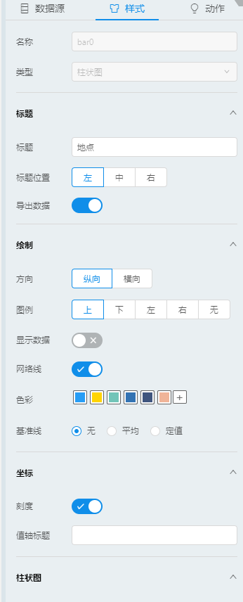

​         标题：设置图表的标题

​	标题位置：设置标题在图中的位置

​	导出数据：若勾选，可以将图中数据导出为CSV文件（预览或者打开页面后，将鼠标定位到图片右上角，会出现三个小图标，其中的导出数据按钮根据这里的选择确定是否可用）

​	方向：设置图的显示方向，默认为横向

​	图例：设置图例在图中的位置

​	显示数据，若勾选，在图中柱子上会显示相应指标数据

​	网格线：若勾选，图中显示和坐标轴平行的网格线

​	色彩：设置该图使用的色系。按照从左至右的顺序选用颜色渲染

​	基准线：平均是按照指标的平均值画出的均值线，定值是通过设定值在图中画出基准线

​	刻度：设置坐标轴刻度

​	值轴标题：设置指标所在轴对应标题，常用做单位显示

​	堆叠显示：多个指标叠加在一起显示，每个指标用不同颜色表示

​	柱子背景：给柱子加上阴影背景

​	风格：设置柱子边角是方形还是圆角

​	趋势线： 按照已有值通过统计学分析方法画出指标变化趋势

3）动作

点击事件-下钻：含有多个维度的柱状图，可以点击柱子进行下钻

​	以前面的SQL语句为例，如果不选下钻会用符号连接起来显示，如果选择下钻，渲染后的图会按照第一个维度来显示，点击柱子按照第一个维度和第二个维度连接来显示，以此类推，钻取到最后一个维度后若再次点击柱子可以回到原始状态。

点击事件-数据交互：设置数据与参数的关联关系，用于图表进行联动

category：将所点击柱子对应的维度传递给所选参数，如2016~07

​	series：将所点击柱子对应的指标名称传递给所选参数，如“销量”

​	value：将所点击柱子对应的指标值传递给所选参数，如3836738

​	以上面的柱状图为例，将三个属性分别关联para0、para1、para2，并且新打开一个柱状图，将数据源SQL查询设置为

SELECT

​	${para0} as '年',

​	${para1} as '月',

​	${para2} as '销量' 

FROM

  dual

​	然后点击“获取数据”，会有错误提示，因为参数没有默认值，此时不需管他，保存或者预览该报表。

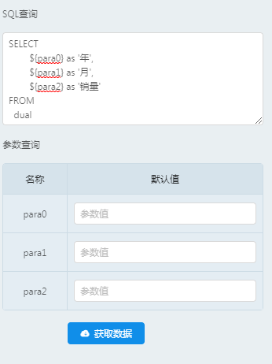

报表中左边显示柱状图，右边不显示

点击柱子后，右侧显示对应数据生成的柱状图。

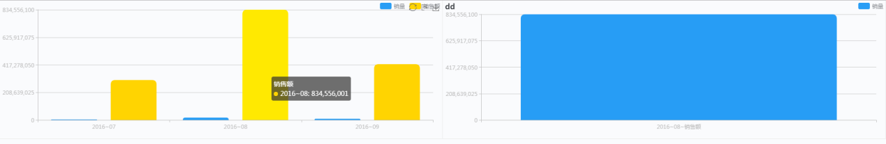

#### 折线图

折线图的设置和柱状图基本一致，不同之处如下：

​	显示圆点：折线图的拐点用远点来代替

​	显示面积：折线覆盖区域用颜色渲染

​	堆叠显示：第一根折线位置不变，其他折线依次按值叠加显示

​	数据缺失：设置只有维度没有指标数据的点是否连接

折线风格：设置点之间以直线还是曲线进行连接

​	预测线：设置最后几个点改由直虚线连接

#### 折柱混合图

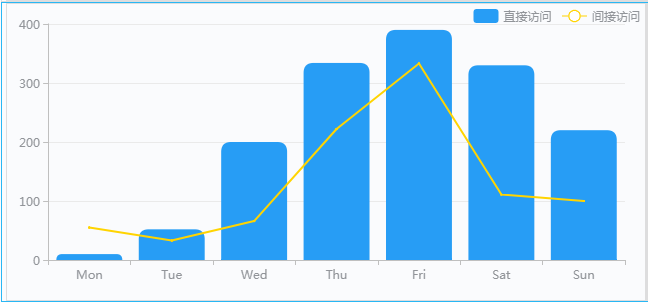

折柱混合图的设置和柱状图基本一致，不同之处如下：

SQL查询：与柱状图相比，折柱混合图查询结果至少包含两个指标（数值），且最后一个指标用折线显示

空心效果：设置环形饼图的空心大小

​	标签：设置是否在饼图上显示数据

​	标签位置：设置标签与饼图的相对位置	

​	标签文字：设置标签显示数据的格式

#### 热力地图

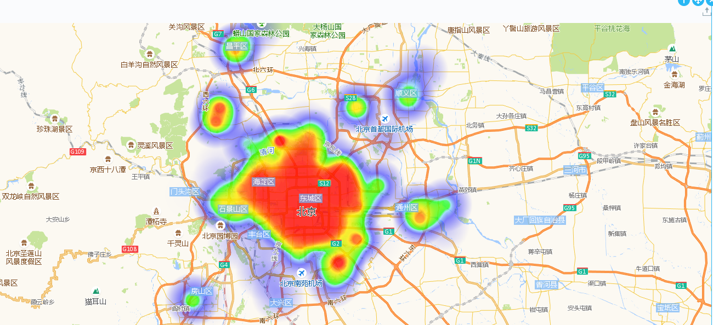

热力地图的设置差异如下：

​	SQL查询：热力图数据结构由三个字段组成，经度和纬度（如果已知地名，需要获取坐标点，可以使用百度“拾取坐标系统”http://api.map.baidu.com/lbsapi/getpoint/index.html），以及该坐标点对应的统计值，示例如下

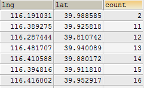

热力半径：设置每个热力点的显示半径，半径越大，重合区域越多

​	地图中心：设置地图中心显示的地区

​	放大级别：拖动设置地图放大比例

​	地图风格：设置地图的显示风格

#### 标记地图

标记地图中显示的标记如上图所示，如果地图缩小后标记出现重复，则显示重复区域的标记数量，点击该数量标记地图放大显示该区域的标记。当鼠标移动到标记上会显示标记的相关信息。标记地图的设置差异如下：

​	SQL查询：标记地图的数据结构由5个字段组成，分别是：name(名称)、lng(经度)、lat（纬度）、amount(统计数量)、info(描述信息)。其中经、纬度和amount是地图标记的关键，格式不能改变；name可以是任何字符串，也可以为空，但是必须要保留该字段的位置；info根据实际情况可以不采用。数据示例如下

标识色彩：设置地图中标记的颜色

​	标识符号：设置地图中的标识符号的样式

​	标识大小：设置地图中标识符号的大小

#### 路线地图

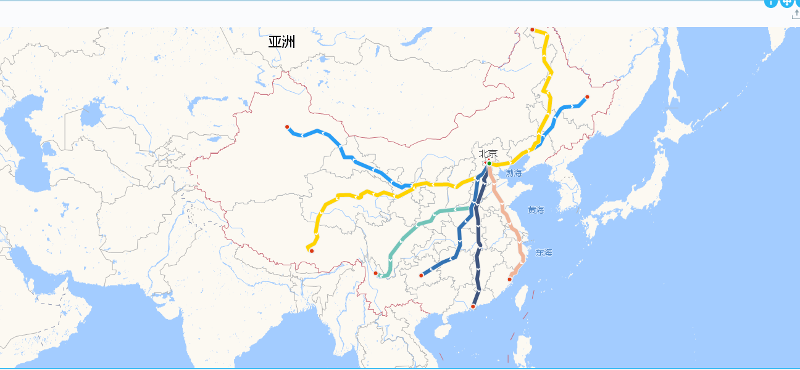

路线地图的设置差异如下：

​	SQL查询：路线地图的数据结构由两个字段组成，name可以是任何字符串，每行name相同则为同一条路线；pathdate通过是经过坐标点的时间，用于排列坐标数据的顺序；最后两列为坐标点的经纬度坐标。数据示例如下：

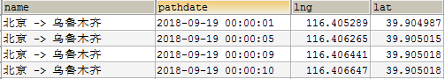

轨迹色彩：设置每条轨迹的颜色，如果轨迹数超过预设颜色，则循环采用设置颜色

​	轨迹宽度：设置轨迹线条的粗细

​	轨迹箭头：设置在轨迹中是否绘制方向箭头

​	显示关键点：设置在轨迹中是否显示重要的拐点

​	轨迹巡航：设置是否在轨迹上用巡航器显示路线

​	巡航器样式：设置巡航器的样式

#### 迁徙地图

迁徙地图的设置差异如下：

​	SQL查询：迁徙地图的数据结构由7个字段组成，分别是：fromname(起始地名)、fromcoords(起始坐标点)、toname(到达地名)、tocoords(到达坐标点)、tovalue(到达点的数值)、name（迁徙路线描述）。其中fromname的每一个不同值都会在地图右下角显示一个图例，点击该图例出现以点击值为起点的迁徙图；设置tovalue的数值可以在到达地点会标出一个圆点并显示信息；name的值会显示在迁徙路线上。数据示例如下

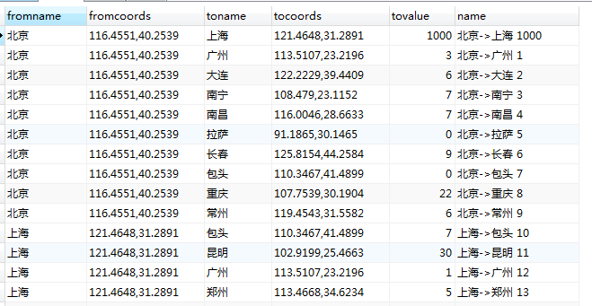

#### 表格

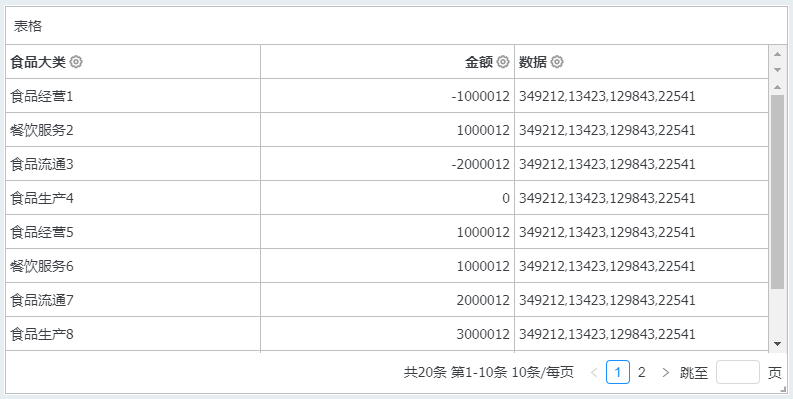

表格的设置和图差别很大，在数据结构上比较灵活，表格的设置如下：

​	SQL查询：只要是在数据库可以执行通过的语句都可以，查询的字段名就是表头。

​	**表头**

​	表头文本颜色：设置表头文本颜色

​	表头背景颜色：设置表头背景颜色

​	表头字号：设置表头文本字号

​	表头文字加粗：设置表头文本加粗

​	表头分组：对表头进行手动分组设置

​	**数据**

数据文本颜色：设置数据文本颜色

奇数行背景色：设置奇数行背景颜色

偶数行背景色：设置偶数行背景颜色

数据字号：设置数据文本字号

排序：设置是否开启点击表头进行排序的功能

​	**分页**

​	分页：设置是否对超出高度的记录进行分页，不分页则显示滚动条

​	页长：设置每页显示的行数

​	统计信息：设置是否在表格底部显示表格记录统计信息

​	**总计**

总计：设置是否打开总计行

​	汇总方法：设置汇总方法

​	总计文本颜色：设置总计文本颜色

​	总计背景颜色：设置总计背景颜色

​	总计字号：设置总计文本字号

​	总计文字加粗：设置总计文本加粗

**预警**

​	预警方案：设置是否开启预警方案（支持设置3个预警方案）

​	预警条件：设置表格预条件

​	预警色彩：设置预警色彩，预警色彩用于单元格背景的显示

列宽：设置单列列宽

​	对齐方式：统一设置单列数据的对齐方式，包括表头、数据和总计

​	汇总方式：设置单列数据的汇总方式。若所选列的数据为数值类型，则有以下汇总方式：求和、平均值、最大值、最小值、计数、计数（去重）、方差、标准差、中位数；若所选列的数据为文本类型或日期类型数据，则有以下汇总方式：计数、计数

​	数据类型：设置单列数据类型，类型、选项及展示效果列表如下：

| 类型         | 选项                                                         | 展示效果                                                     | 特殊要求             |
| ------------ | ------------------------------------------------------------ | ------------------------------------------------------------ | -------------------- |
| 字符串       | 自动换行                                                     | 开启：显示不全的字符串换行显示关闭：显示不全的字符串省略号显示，鼠标滑过出现提示 | 无                   |
| 数字         | 数字格式                                                     |                                       | 字段数据必须为数值型 |
| 数据条       | 显示数值数分离标签正值条颜色负值条颜色目标线                 | 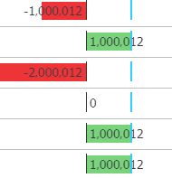                                      | 字段数据必须为数值型 |
| 趋势箭头     | 显示数值低阈值高阈值箭头样式                                 |                                       | 字段数据必须为数值型 |
| 迷你柱状图   | 图形大小显示值阈值1、阈值2、阈值3的对应数值和图形颜色，以及低于所有阈值的图形颜色 |                                       | 字段数据必须为数值型 |
| 字体色阶     | 最低值颜色最高值颜色                                         | 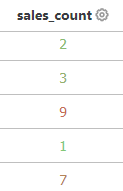                                      | 字段数据必须为数值型 |
| 背景色阶     | 最低值颜色最高值颜色                                         | 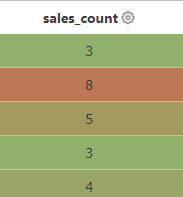                                      | 字段数据必须为数值型 |
| 百分比象形图 | 选择图形显示数值填充颜色                                     |                                       | 字段数据必须为数值型 |

####  指标点阵图

指标点阵图的设置差异如下：

SQL查询：指标点阵图的规范查询结果包括2字符串字段和2个数值型字段。第一个字符串字段为详细信息，第二个字符串字段为数据类别；紧跟着的2个数值型字段分别应用于x轴和y轴。数据示例如下：

色彩透明度：左右滑动透明度滑块，统一调整所有图形的色彩透明度

散点形状：设置散点的形状

X/Y轴基准线：设置基准线，可以以平均值为标准，也可手动输入数值

趋势线：设置是否显示趋势线以及趋势线的形式

X/Y轴坐标开关：设置是否显示X/Y轴坐标

X/Y轴刻度开关：设置是否显示X/Y轴坐标上的刻度

X/Y轴标题：设置X/Y轴的标题

X/Y轴数据单位：根据选择的单位来对数据进行格式化，例如选择了万为单位，则123,400被显示为12.3。

网格线：设置是否显示十字网格线 

#### 嵌套环形图

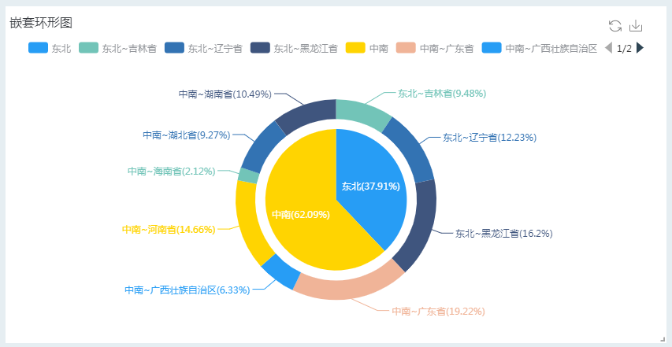

嵌套环形图的设置差异如下：

SQL查询：嵌套环形图的规范查询结果可包括1至3个字符串字段，表示数据的分类信息，类别、子类和三类，且有上下级分类关系，最多可表示3级；紧跟着一个数值类型字段，表示指标。

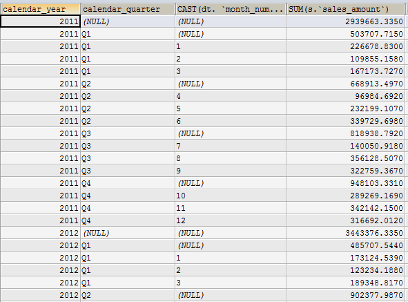

标签：设置是否在图表上显示数据标签

间隔：设置内圈与外圈之间的间隔大小

标签文字：设置标签文字展示的信息形式

#### 南丁格尔玫瑰图

南丁格尔玫瑰图的设置差异如下：

​	SQL查询：玫瑰图的规范查询结果只包括一个或多个字段，前一个字段或多个字符串类型字段，表示数据的类别信息；紧跟着的列为数值型数据，当有多个字符串类型字段，开启下钻时则可用于下钻展示；当关闭下钻时，用“ ~ ”符号连接字符串。

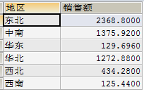

空心效果：设置玫瑰图的空心大小

标签：设置是否在图表上显示数据标签

标签位置：设置标签与玫瑰图的相对位置	

标签文字：设置标签显示数据的格式

#### 热力图

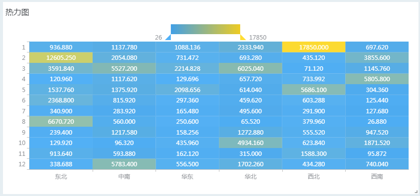

热力图的设置差异如下：

​	SQL查询：热力图的规范查询结果首先是包含2个字符串类型字段，用于x轴和y轴；紧跟着的为一个数值类型字段。数据示例如下：

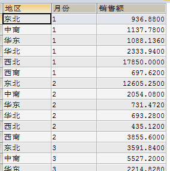

图例类型：设置图例是颜色渐变还是颜色分组

色彩：设置图例对应的颜色

数据单位：根据选择的单位来对数据进行格式化，例如选择了万为单位，则123,400被显示为12.3。

X/Y轴标题：输入文字设置X/Y轴标题，

X/Y位置：设置X/Y轴在图表中的位置

坐标刻度：设置是否显示X/Y轴的刻度

预警：可打开预警方案，设置预警条件

#### 漏斗图

漏斗图的设置差异如下：

​	SQL查询：漏斗图的规范查询结果包括1个或几个字符串字段，用作类别，当有多个字符串字段时，会以“~”符号连接使用。紧跟着字符串字段的是一个数值型字段，表示指标。数据示例如下：

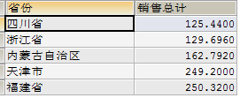

方向：可选择图像翻转的方向。

标签：设置是否在图表上显示数据标签，设置标签的位置

显示数据：设置是否在漏斗图图形上显示对应数据

#### 油量图

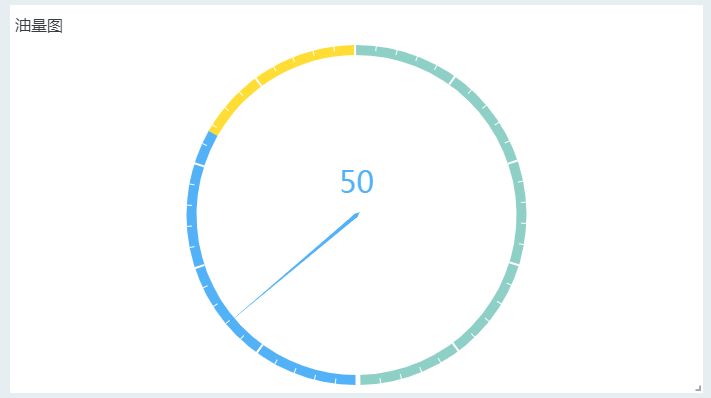

油量图的设置差异如下：

​	SQL查询：要求第一列数据为数值，数据示例如下：

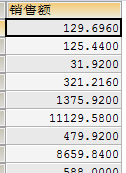

仪表盘类型：可以选择指针或圆环类型

数据分组（指针仪表盘的选项）：可设置数据分组区间以及区间对应颜色

起止颜色（圆环型仪表盘的选项）：设置起始值和终止值对应颜色

仪表盘角度：设置仪表盘展示的角度

仪表轴线宽度：设置仪表轴的宽度

分割线数量：开启后手动输入数值，设置将表盘均分成多少段

刻度线数量：开启后手动输入数值，设置每个段内显示的刻度线数量

刻度样式：设置刻度在仪表盘内部或外部

最小值/最大值：根据最小值和最大值来决定当前值所所处于的位置

#### 词云图

词云图的设置差异如下：

​	SQL查询：词云图的规范查询结果只包括至少一个或两个字段，第一个字段是显示在屏幕中的词，第二个为数值。数据示例如下：

词云形状：设置词云图整体显示的形状

文字大小：设置最小值和最大值文字的大小

字符间距：设置文字间的间距

文字角度：设置文字显示的角度

#### 关系关联图

关联关系图的设置差异如下：

​	SQL查询：关联关系图的规范查询结果包括以下字段：源节点（必须，字符串），源节点类别（字符串），源节点数据（必须，数值），目标节点（必须，字符串），目标节点类别（字符串），目标节点数据（必须，数值）。数据示例如下：

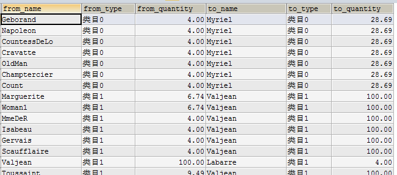

连线风格：设置源节点与目标节点间连线为直线还是曲线

显示数据：设置是否在每个节点右侧显示节点对应数据

节点文字：设置是否每个节点右侧显显示节点对应名称

节点标记：设置节点图形的形状

节点大小：设置节点图形的大小

节点斥力：设置节点间的斥力

节点拖拽：开启后可在图上选中一个节点进行拖拽操作。

鼠标缩放：开启后可通过鼠标滚轮进行放大缩小操作。

平移漫游：开启后可在图表区域内任意移动图表内容的位置。

#### 桑基图

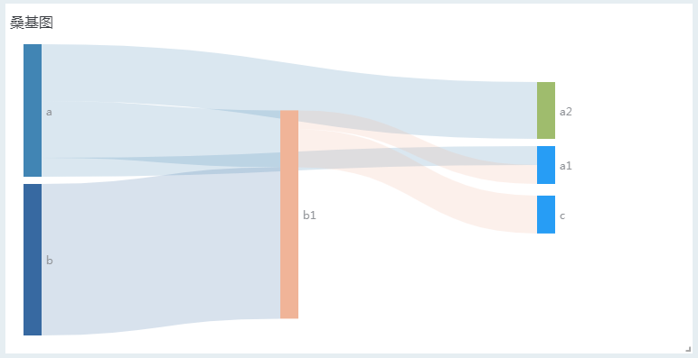

桑基图的设置差异如下：

​	SQL查询：桑基图的规范查询结果只包括三个字段，分别是来源、目标和指标，数据示例如下：

连线风格：设置来源与目标间连线为直线还是曲线

节点文字：设置是否显示来源与目标节点处的文字信息

#### 河流图

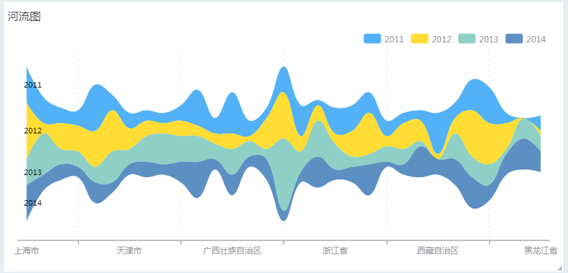

河流图的设置差异如下：

​	SQL查询：河流图的规范查询结果只包括三个字段，分别是x轴、系列和指标，数据示例如下

网格线：设置是否在图上显示纵向网格线

刻度：设置是否显示x轴上的刻度

值轴标题：输入文字，设置x轴的标题

#### 自定义图表

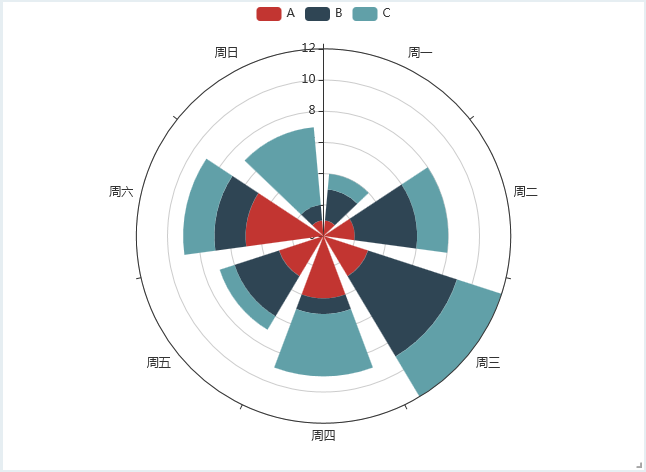

自定义图表组件，允许用户自由编写图表代码，实现定制化的可视化效果，如上图。

1) 数据源面板

i. 自定义sql查询，自由获取数据库当中的数据，获取的数据可在自定义代码中使用。

ii. HTTP：调用http协议的api接口获取数据，获取的数据可在自定义代码中使用。

iii. Websocket：调用websocket协议的api接口获取数据，可接收服务器可主动推送过来的数据。利用websocket协议的长连接主动数据推送的能力，实现实时数据可视化渲染。如下图所示，每秒会收到图表推送的数据，每次收到数据后，图表都能根据最新数据实时刷新。

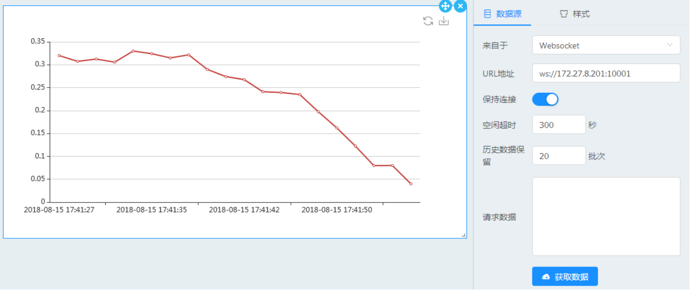

1) 样式面板

样式面板中提供了代码编辑器，示例代码如下所示：

//获取数据源中查询出的数据

var data = this.cfg.chartDefinition.data;

//系统中内置了echarts ，可编辑option直接实现各种echarts效果；

var option ={xAxis:{type:'category',data:['Mon','Tue','Wed','Thu','Fri','Sat','Sun']},yAxis:{type:'value'},series:[{data:[820,932,901,934,1290,1330,1320],type:'line'}]};

//将echarts实例绑定到布局中的html对象

var echartsInstance;

if(this.echartsInstance) {

  echartsInstance = this.echartsInstance;

}

else {

  echartsInstance = echarts.init(this.htmlObj);

};

echartsInstance.setOption(option,true);

echartsInstance.resize();

​	由于仪表盘内置了echarts, 因此可直接编辑echarts的图表选项option，即可实现各种echarts效果。如果要使用d3来绘制图表，需要先加载d3代码库，然后再回调中写逻辑。

Dashboard.queryAction.getScriptOnce({

  name: 'd3',

  src: 'https://d3js.org/d3.v5.min.js'

}).then(function(){

  console.log('succ');

}).catch(function(e){console.log(e)});

由于绘图引擎的切换，需要先手动清除之前的数据，否则造成多个引擎渲染的图表同时存在。可以根据引擎的方式清除，如echart可以调用echartsInstance,dipose()方法来清除。

### 添加组件

仪表盘中的组件作为图表显示的辅助手段，提高页面的交互能力。拖动一个组件到画布或容器当中，并对组件进行设置，下面就每个组件的设置和交互场景进行说明。

#### 文本组件

文本组件是一个简单的富文本编辑器，可以提供一些富文本功能。基本设置如下：

文本内容：设置文本的具体内容，包括字体，字号，对齐方式和文字颜色，工具栏Ω可以添加一些内置符号（可大小和改变颜色）。文本内容中可以插入参数，来展示通过查询返回的数据内容。

​    文本组件中，还可以设置文字滚动效果，并可为其中的文字添加超链接。

#### 单选框

保存选择到选项指定保存的参数，如选择“宝马”，将宝马存储到对应参数

#### 日期选择器

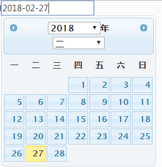

日期选择器可设置开始和结束日期，控制日期可选择的范围。

开始日期：设置选择器可以选择的最小日期

结束日期：设置选择器可以选择的最大日期

#### 下拉框

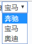

下拉框的设置和单选框完全一致，只是组件显示的方式不同。

#### 多选下拉框组件

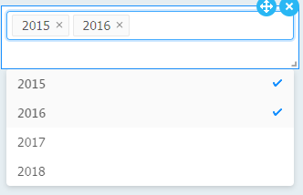

多选下拉框的设置和单选框几乎完全一致，唯一的不同点是：多选下拉框可以同时勾选多个值，并且以数组的形式保存到参数中。

#### 图片组件

图片组件设置项如下：
文件/URL：可以输入图片文件的资源库路径，也可以输入URL地址。也可以直接选择下方资源库中的图片文件。图片组件支持jpg, png, gif,bmp四种类型文件。
图片位置：设置图片在组件中的显示方式，如居中、拉伸、填充、平铺。

#### 视频播放组件

视频播放组件设置项如下：
视频地址：输入MP4格式视频地址
封面地址：可设置一张图片作为视频封面，在自动播放关闭时起作用。如未设置，则使用视频第一帧作为封面
循环播放：是否要循环播放
自动播放：是否要自动播放

#### 容器组件

容器组件内部可以放置图表、组件或控件，可通过拖动任意改变图表、组件或控件的大小和位置。

#### 轮播组件

轮播组件可以将区域分层，每层都是一个容器，容器中可放入多个图表或组件，并定时重复切换展示其中的内容。

#### 多维分析文件

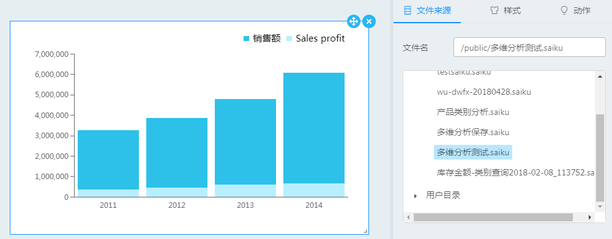

可从文件资源库中选择一个已完成的多维分析文件显示在该组件中。如果多维分析文件的维度上设置了参数，则将显示该文件的可用参数，可将仪表盘中的参数转递到多维分析图表中，实现图表数据的传递和联动

#### 动态数轴组件

动态数轴组件将序列数据显示以轴线刻度的形式显示，间隔一定时间滑块自动移动到下一个刻度，引起关联的图表自动循环发生改变。
动态数轴只需要1列数据，其它列的数据将被忽略。
对样式的设置面板包括以下选项：
色彩：可以分别设置轴线、节点和滑块的色彩
方向：轴线横向或纵向放置
文字位置：文字显示在轴线上方或下方（横向轴线），或显示在左、右方（纵向轴线）
数轴粗细：调整轴线的粗细
节点形状：调整节点和滑块的形状
节点尺寸：调整节点的大小
滑块尺寸：调整滑块的大小
自动播放：滑块定时自动滑动到下一节点
播放顺序：控制滑块正向或反向滑动
播放间隔：控制滑块自动滑动的间隔时间
播放按钮位置：控制播放按钮相对于轴线的位置
控制按钮尺寸：调整控制按钮的尺寸大小
保存选择到：将滑块所处位置的数据保存到参数中，供其它关联图表使用

#### 指标卡组件

指标卡可以接受一个或两个指标，并可以接受多行数据进行分组展示。可以对指标卡进行如下设置：
排列方式：当展示两个指标时，横向或纵向排列指标。
主指标标题、字号和颜色：开启或关闭主指标的标题，并可设置字号和颜色。
副指标标题、字号和颜色：开启或关闭副指标的标题，并可设置字号和颜色。
指标类别：当有多行数据返回时，是否将每行数据的标题进行展示，同时可设置其对齐方式和文字大小。
指标卡显示数量：当有多行数据需要展示时，最多可以展示的指标数量。
背景：指标卡的背景色彩。
条件方案：可设置条件方案，指定满足条件的指标的符号和色彩，该色彩将会覆盖前面指标的颜色设置。

#### 图表下钻

对于柱状图折线图等常规图表，拥有图表下钻的功能。要启用图表下钻功能，方法如下：
1、绑定数据界面，在x轴（以柱状图为例）框中放置多个字段，字段从上至下的顺序是下钻的路径，可以任意使用不同的维度层级组合下钻的路径。

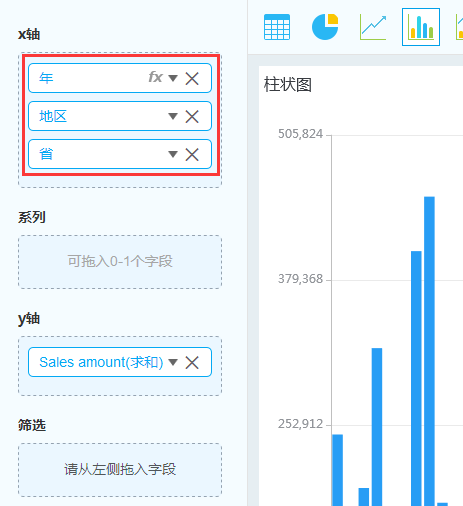

2、点击完成回到画布，在该图表的动作面板中，点击事件动作选择下钻即可启用图表下钻。点击图中每一个柱子均可下钻到下级，到底层时再次点击可回到上层。或者点击图表右上角的刷新按钮返回最顶层

### 图表联动

#### 图表之间联动

图表之间的联动流程为，点击源图表时获取到的数据，通过参数传递到联动图表，引起联动图表的改变。实现步骤如下：

1、新建一个参数，点击下方的设置 > 管理参数，点击右侧面板右上角的 + 新建一个参数，并输入名称，其它选项可保持默认。

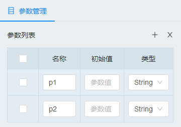

2、源图表设置，在源图表的动作页面中，点击动作设置为数据交互，并设置将何种内容保存到参数之中。图中的category、series对象通常对应x轴（类别）和系列数据，value即用于渲染图表的数值。某些图表没有series对象，如饼图

3、联动图表的数据筛选设置，打开需要联动的图表的数据绑定界面，拖动字段到筛选框，弹出的对话框中，选择条件筛选，然后点击插入参数，选择源图表用到的那个参数。设置好筛选条件后，如果前面没有点击源图表将一份数据存储到该参数，可能会提示当前图表无数据。此为正常现象，点完成按钮回到画布，再点击源图表，联动图表将会看到数据变化。

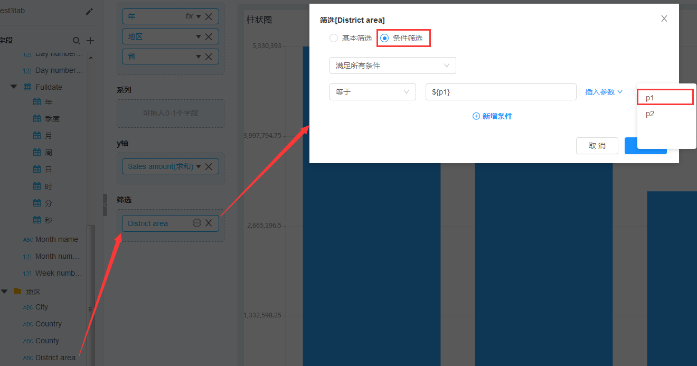

#### 图表与空间之间联动

图表与控件之间的联动流程为，将控件的数据通过参数传递到图表，触发图表重新获取新而改变。
1、新建一个参数，方法同上小节。
2、控件设置，在控件的属性面板上，将控件的选择保存到一个参数当中

3、图表的数据筛选设置，打开需要联动的图表的数据绑定界面，拖动字段到筛选框，弹出的对话框中，选择条件筛选，然后点击插入参数。操作与上节中的方法相同，见图3.6.6-5所示，控件选择不同的内容，下方的图表会立即发生变化

### 调整布局

图表或组件可以直接拖动到画布中，形成一个布局块，可拖动右下角角标调整图表占据画布的位置和大小。如果想要将几个组件组合在同一个布局块中，可以使用容器组件。
拖动左侧组件类别中的容器组件（空白布局组件）到画布，如下图中容器组件正在调整大小

点击选择一个图表或组件，右上角显示移动和删除按钮，点击移动可以将组件移动位置；点击删除按钮可图表或组件，若删除的是容器组件，则内部所有内容将同时删除

### 管理参数

点击面板下方的设置 => 管理参数 打开参数列表。参数列表可以对参数个数、参数类型和默认值进行设置，参数列表的作用范围是整个仪表盘。所有图表之间的数据交互都是依靠参数完成的，图、表或者组件绑定了参数后，当相关内容发生改变，引用到这些参数的图表或组件的数据也会发生相应改变

添加了参数之后，任何图表和组件的数据源，都可以使用参数的查询条件，在参数改变后，可查询出不同的数据。控件类的组件，还可以将控件选择的数据保存到一个参数，触发使用该参数的数据源的图表的即时刷新

### 主题设置

点击面板下方 设置 => 主题设置 打开主题设置面板，可以选择不同主题。除了系统给出的几个主题可以设置，也可以选择最后一个“自定义”，此时可以做以下设置：
布局边框：设置布局容器的边框显示方式
图表色彩：设置图的渲染颜色风格，可以快速对柱状图、折线图、折柱混合图、饼图进行上色。
图表背景色彩：设置除地图外其他图表的背景颜色
图表文字色彩：设置除地图外其他图表中的文字颜色
图表线条色彩：设置除地图和表外其他图中的坐标轴、网格线颜色
整体背景色彩：设置布局容器以外的背景颜色
背景图片：设置整个仪表盘的背景图片

### 页面扩展

除了对仪表盘的基本设置以外，可以通过页面扩展功能来完成更加丰富的设置。点击面板下方 设置 => 页面扩展 打开页面扩展面板，可以对页面添加CSS和JS脚本。每个图表或组件都有自己的名称，在组件的样式面板中可见。在CSS和JS脚本中可直接对图表或组件元素进行引用，然后编写CSS或JS代码对其进行自定义操作

### 保存仪表盘

点击下方的保存按钮，右侧弹出保存面板，填写文件名和保存位置，即可将仪表盘保存到指定位置。

## 数据门户

点击主菜单 =>分析与报表 =>新建数据门户，选择一个门户模板后打开数据门户设计器

上图是数据门户界面，分为预览区和设计区，我们在设计区中作出的设置，在预览区可以即时得到呈现。可点击按钮收起设计区，所有区域完全供预览展示

### 页面菜单设置

在设计区中导航设置页面，可设置页面的标签和菜单。菜单深度最多包含3层，每个菜单项均可以设置文字和图标，并设置点击时是否打开一个页面

有的模板不支持层次结构的菜单，该类模板会将菜单内容逐一显示而无法体现出菜单层级

### 选择门户模板

当进入数据门户模块时，将提示你选择一个门户模板，系统提供6个默认模板，分别将页面组织成不同的形态

在门户制作过程当中，也可以随时切换模板。点击设计区中的“模板设置”标签，选择模板右侧的“切换”按钮，可再次弹出上图中的选择门户模板对话框，切换模板后，左侧的预览区将即时反应变化

### 模板设置

切换到模板设置标签后，可以设计页面的标题、Logo图标、首页（打开该数据门户时应展示的页面）、主题色彩和用户信息的隐藏和显示
对于logo图标，可以先上传到平台的门户系统中，再点击浏览按钮选择，也可以手动输入图标的URL地址
对于主题色彩，提供了3种主题色彩选择，将改变整个页面框架的色彩，以对加载的内容进行风格适配统一

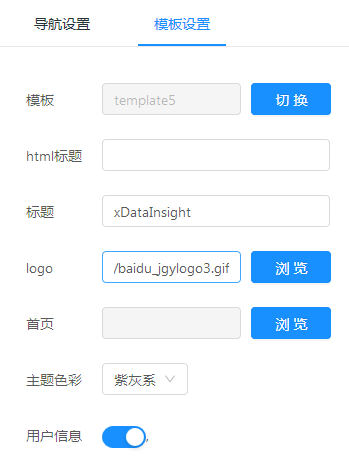

### 门户保存

完成制作之后，点击保存按钮，输入名称并选择保存位置即可保存到平台。并可以文件管理中浏览和打开。