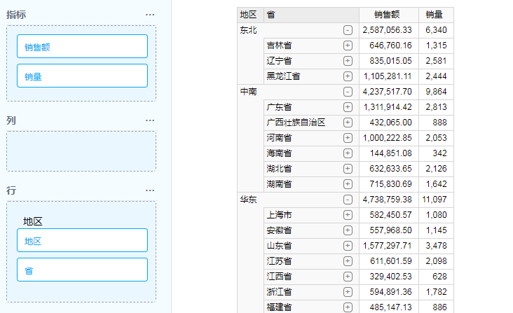
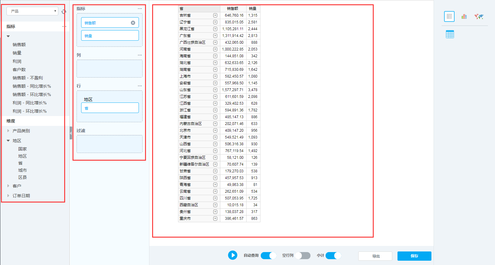
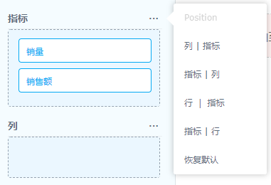

# 多维分析

关系型联机分析处理（ROLAP）是联机分析处理（OLAP）的一种形式，它对存储在关系数据库（而非多维数据库）中的数据作动态多维分析。实现钻取、旋转、切片、切块等多维数据分析功能；支持图表输出与操作，支持丰富的图表种类，可直接在图中钻取分析；可直接浏览微软的多维立方体；支持数据排序、过滤、维间运算、显示百分比等功能。

### 创建图表

如下图所示，在导航菜单栏“分析与报表”中点击“新建多维分析”，创建多维分析。

### 分析工作区结构

多维分析工作区结构如图所示。整个页面分为五个区域，分别是：数据集选择、分析维度设置、分析工具栏、展示方式选择、分析结果展示。

l 数据集选择：选择要分析的数据集

l 分析维度设置：选择指标、维度、维度过滤对数据集进行分析

l 分析工具栏：

1) 运行查询、自动查询：调整多维分析运行状态。

2) 空行列：设置是否过滤空值

3) 小计：显示/隐藏父节点，在分级维度时使用，可以显示上级汇总数据，如图3.5.2-2所示。

4) 导出：导出XLS文件、导出逗号分隔的CSV文件、导出PDF文件，导出分析结果为相应格式。

5) 保存，将多维分析保存到指定目录下。

​                                                     选中“小计”可统计父级数据

l 展示方式选择：可选择图表、图形、地图的可视化效果对分析结果进行展示。

l 分析结果展示：面积最大的展示区用来展示分析结果。

### 分析图表并选择展示方式

如下图所示，在“数据集选中”的下拉框中选择一个多维数据集（在数据集导入时导入，也可通过敏捷数据建模发布），显示出分析窗口，如图所示。

可以任意选中几个指标和维度，即可自动分析出计算结果，如图3.5.3-3所示。

表格中的维度，如果是分级维度，并且不是最后一级，可以点击维度上面的“+”，展开该维度对应的下一级，这一点和excel的展开有所区别，如果点击“-”则回到上级维度页面。

在进行以上操作时，分析维度设置区域内容会相应进行变化

如果要想通过图形观察所得结果，可以点击右侧展示方式选择面板，如图所示，其中三个小图标分别表示表格、图像和地图。

如图所示，点击图像中的柱状图，即可在显示区域出现由表格数据生成的柱状图，将鼠标光标拖至柱子上方会出现数据提示。

点击图像中的气泡图，即可根据选定数据源，给定指标、行、列，展示期望的图形效果，如图所示。

也可以根据具体业务选择其他图形进行展示。如果要展示地图，则需要选中的维度能够提供相应地图的数据

地图是可以点击进行下钻的，但是下钻后不会有数据，为了保证地图下钻后也有数据，需要满足两个条件：地区所选维度包含需要显示数据的级别；工具栏“小计开关”打开。

多维数据分析可以增加到对多个维度和指标数据的分析

### 指标显示方式

点击指标右上角的省略号，显示选项如图所示。可根据分析需求将指标布置到行或列坐标当中，并可改变指标与行或列间的层次关系。

下拉选项不同选择改变表格的分析维度。如下图所示，选择“列-指标”，所选列维度为纵向第一层级，所选指标为纵向第二层级。

如下图所示，选择“指标-列”，所选指标为纵向第一层级，所选列为度为纵向第二层级。

如图所示，选择“行-指标”，所选行维度为横向第一层级，所选指标为横向第二层级。

如图所示，选择“指标-行”，所选指标为横向第一层级，所选行维度为横向第二层级。

如下图所示，选择“恢复默认”，表格恢复默认设置。

### 维度过滤

如下图所示，点击“行”或者“列”下面的维度（如：省），会选中相应维度，并出现省略号，点击省略号即可弹出如图所示的维度成员过滤窗口，对维度成员进行选择过滤。

将维度拖至“过滤”窗口下，该维度参与过滤，如图所示。 

图中打钩的选项“仅显示上下级相关成员”表示：在上级过滤完成后，如果勾选该选项，“可用成员”则只包括过滤后的下级成员。

可以在窗口下直接选择具体某个值并点击右箭头，将其移至右侧结果集，也可在查找框里输入要选择的值快速选择目标值到右侧结果集，选中“显示全名”选择框，可以显示出过滤值的层次结构（如图3.5.5-8），点击“确认”即可实现过滤，结果如图

如果希望过滤值不要在查询结果中出现，可以将维度放入“过滤”栏，如图所示。

### 数据排序

可以在“行”或者“列”上点击省略号，并用排序里面的选项对统计的指标进行排序，如图所示。

排序的四种方式分别为：组内排名（升序）、组内排名（降序）、总排名（升序）、总排名（降序），也可以用自定义MDX语句的方式进行排序。

### 维度成员限制

可以对查询结果进行数量限制，如图所示，行列选项上选择“限制”，在选择限制方式，最后选择限制的字段，可实现维度成员限制。

### 指标计算

系统可以进行指标二次计算，并生成计算指标，供分析使用。点击数据集面板下的指标右侧的按钮

点击“新建”按钮，输入计算指标名称和公式，点应用后即可在数据集面板中看到新的计算指标，可像常规指标一样使用。

#### 同环比计算

点击指标计算框中的插入公式旁的链接，选择类别、指标和维度，即可将公式插入公式框中。

### 结果计算

在维度上可以对查询结果进行统计计算，除常规的求和、平均值、最小值、最大值之外，还有方差、标准差和中位数的计算操作

