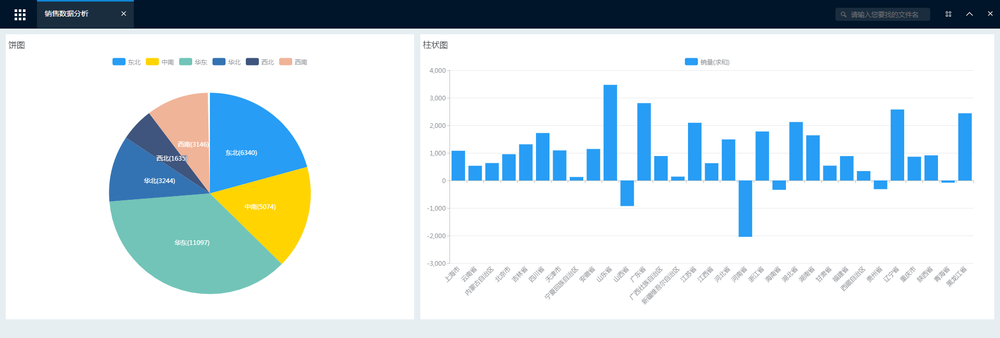

# 操作指南

## 系统登录

打开xDataInsight网站，进入登录页面，输入用户名及密码登录平台。

## 页面功能

登录成功后，进入系统主界面，如下图所示。主界面主要分为四个区域，分别是：主菜单栏、功能快捷入口、案例介绍、帮助视频及教程。​                             

（1）主菜单栏

​       主菜单栏主要包括导航菜单、搜索框、最近访问、收藏夹及用户中心5个部分。

​       在主菜单栏点击   ，打开导航菜单，如下图所示，主要包含5个部分：分析浏览、分析与报表、数据源、设置及文件管理。

● 分析浏览：用户可实现对已有文件的浏览查看。

● 分析与报表：用户可实现多维分析、即席分析及仪表盘、数据门户等功能。

● 数据源：用户可实现数据源及数据集的新建、导入及管理功能。

● 设置：用户可实现角色设置、任务计划设置、邮件服务设置及其他高级设置功能。

● 文件管理：用户可实现对文件的上传、下载、新建、删除等管理功能。

搜索框可实现文件的搜索查找功能。最近访问可以查看最近浏览的文件。收藏夹可查看已收藏的文件。用户中心包括用户信息设置、密码修改、系统退出、帮助中心及关于等功能。

（2）功能快捷入口

功能快捷入口区域包含7个功能的快捷进入链接，方便用户使用。分别是：导入数据、连接数据源、仪表盘、创建业务关系、管理数据源、多维分析、数据门户。

（3）案例介绍

案例介绍是已经完成的例子，可以方便初学者模仿学习。

（4）帮助视频及教程

可以查看xDataInsight介绍和报表制作教程视频，也可以查看基础教程文档。

## 分析浏览

点击“分析浏览”菜单展开如下图所示，包含多维分析、仪表盘、数据门户、定制报表、最近浏览和我的收藏。

选择任意功能标签，点击即可展开对应文件树，此处以“仪表盘”为示例，如下图所示：

从文件树目录中选择任意文件，点击即可实现文件浏览查看如图所示。

页面打开后，顶部主菜单栏展示为标签，点击标签可以切换展示打开的不同内容，右侧工具栏变成。

第一个工具是页面操作菜单，打开后如图所示；第二、三个工具分别是隐藏顶部主菜单栏和关闭所有打开的内容。

导出为PDF：将页面整体导出为一个PDF文件（如果是多维分析文件，没有导出PDF选项，导出功能在打开的多维分析内部；如果是其它自定义页面，也无此导出菜单项）。

编辑：用户可以对所打开的文件页面的内容进行具体编辑。只能编辑由系统创建的多维分析或仪表盘类型的页面。

分享：用户可以为当前页面创建快照，并分享给其它任何人查看。分享的快照在查看时不需要登录系统。目前只对仪表盘可以使用分享功能。

收藏：收藏当前文件页面，方便以后的查找和使用。

设置为首页：将当前文件页面设置为首页，在产品登录首页直接展示。