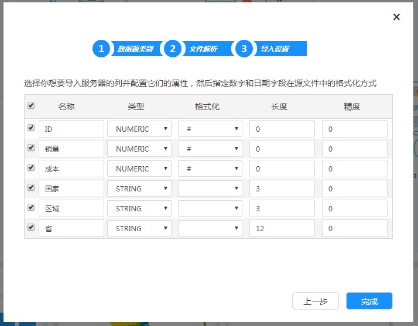

# 操作流程

初次使用xDataInsight，用户需要根据数据创建数据集，以供数据分析和可视化使用，具体流程如下图所示：

# 快速入门指南

xDataInsight产品快速入门指南主要包括两个部分：

1. 导入数据并自动创建数据集；
2. 对数据的查询、分析及可视化展现。

## 导入数据并自动创建数据集

点击导航菜单中“数据源”下的新建数据集，弹出新建数据集对话框。

在新建数据集对话框中，输入数据源名称，选择需要导入文件的类型，如csv，点击下一步，进入文件解析步骤。

在文件解析步骤中，上传数据文件，系统将自动识别文件编码，并以表格的形式预览出来。如果编码识别错误而导致显示为乱码，请手动选择合适的编码。点击下一步进文件行数据的导入设置。

              

在导入设置步骤中，系统会将导入数据的所有列都列举出来，请选择需要导入的列，默认所有列都会导入。系统还会根据数据自动识别列类型，如果识别错误，可以手动修改。

点击完成按钮，系统自动创建数据集，并提示用户是否需要修改。此处选择“保持默认数据集”，点击确定按钮。

## 数据分析及可视化展现

导入数据源链接和数据集后，平台自有的用户自助交互式拖拽多维分析引擎，帮助用户从不同维度、上钻、下钻、旋转、计算、同比、环比等数据分析方式剖析所导入数据。

在导航菜单栏“分析与报表”中点击“新建多维分析”。

在多维分析界面中，左上角选择前面创建的多维数据集，左侧会列出所有指标和维度。点击要展示的指标，再选择合适的维度，主窗口中按维度汇总出所需数据。点击右上角智能图像显示，选择不同的可视化图形，立即使用图形渲染数据，如下图所示。

 我们也可以使用仪表盘设计器来制作仪表盘，生成漂亮的可视化效果，适合在大屏上展示的可视化页面。
