# 数据源

点击导航菜单“数据源”，展开如图所示数据源管理菜单。主要包括新建数据源链接、新建数据集、导入数据集及管理数据源四个菜单。

● 新建数据源链接：用户可以新建链接，实现从各类数据库导入数据。

● 新建数据集：用户可以新建数据集，实现从本地文件、关系型数据库文件、NoSQL文件、大型数据库及其他数据库文件种导入数据。

● 导入数据集：用户可以导入已建立的数据集，完成数据的导入。

● 管理数据源：用户可以选择已经保存的数据源，实现数据的导入。

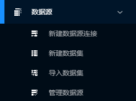

### 新建数据源链接

点击“新建数据源链接”，展开编辑页面如图所示。填写连接名称，选取数据库类型(如MYSQL)，分别填写主机名/IP、数据库名、端口号、用户名、密码后点击“测试连接”。

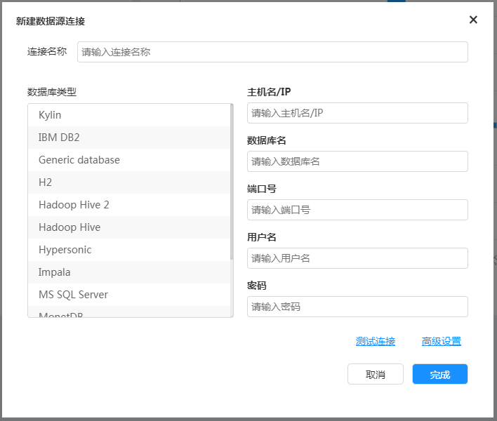

如果通过测试显示如图所示。

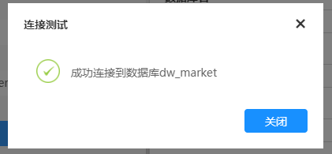

也可以点击“高级设置”，如图所示对标识符的格式进行设置，同时对参数名称和参数值进行设置。

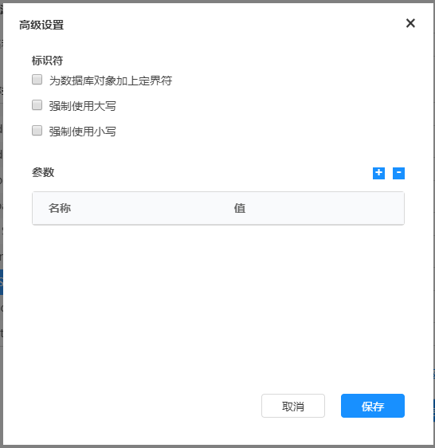

### 新建数据集

点击“新建数据集”，弹出如图所示窗口。用户需要输入数据集名称、选择数据源及数据源连接的类型。数据源连接类型包括新建数据源连接和选择已有连接，数据源的类型包括本地文件、关系型数据库、非关系型数据库、大型数据库及其他数据库等。

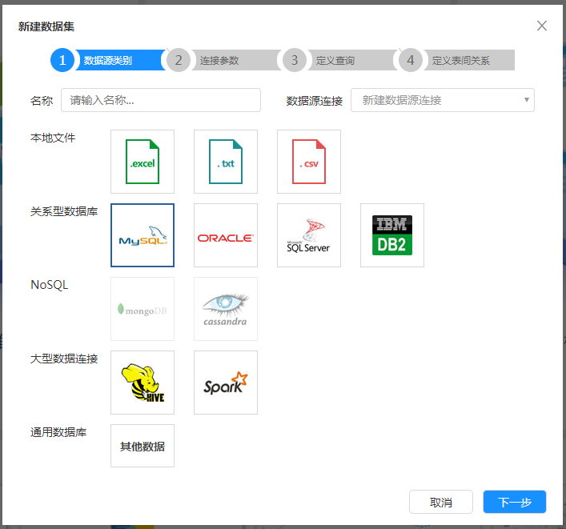

(1) 导入本地文件

首先选择数据源连接类型为“新建数据源连接”，然后选择需要导入的文件类型，xDataInsight产品支持excel、txt、csv格式的本地文件，此处以选择“excel文件”为例，如图所示，点击下一步后上传本地文件。

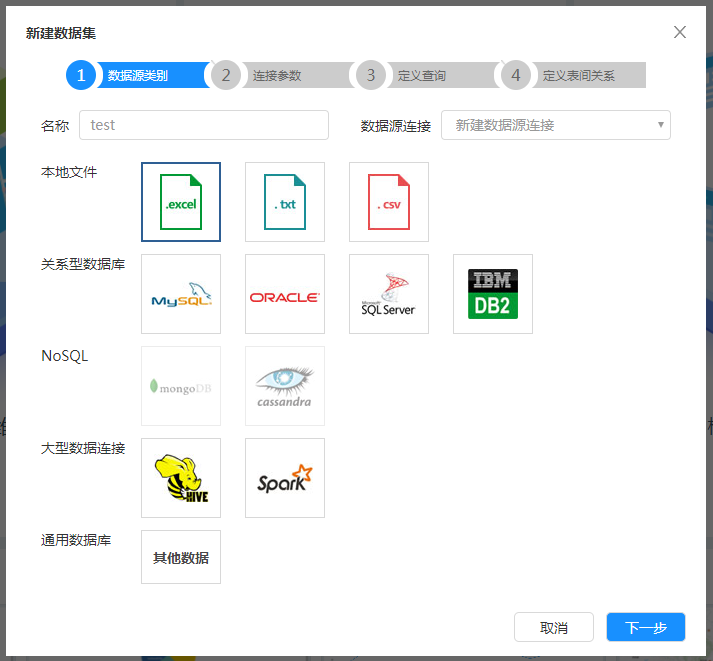

导入文件后，页面如图所示。

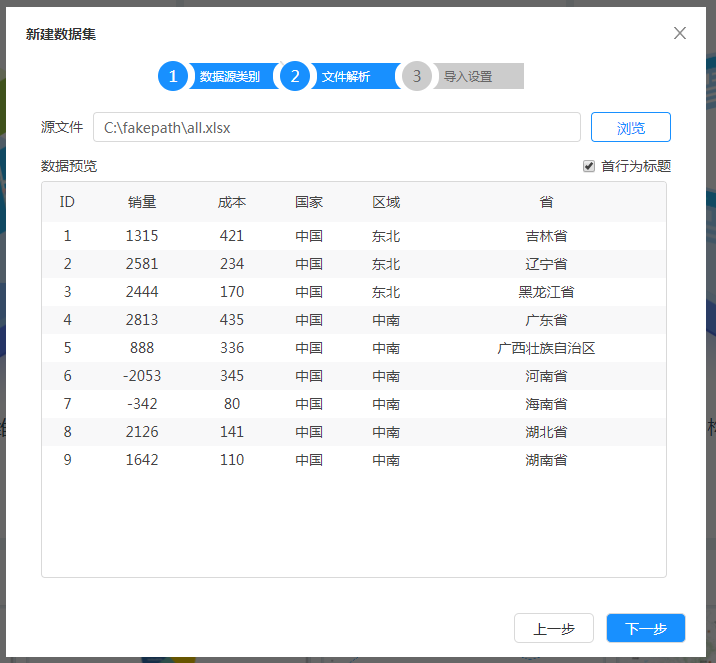

点击“下一步”，进入如图所示的导入设置窗口。在该窗口，用户可以选择需要导入系统的列，默认将全部导入。同时系统尝试自动识别每列的类型，如果识别错误，用户可以修改。如果是数值型或日期型的列，选择的格式化字符串应和预览时的格式相同。点击“完成”即可完成excel文件数据的导入。

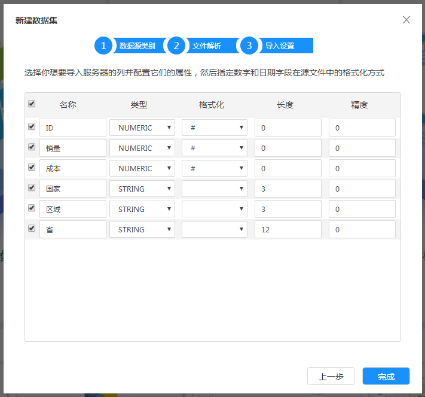

如果用户选择txt格式或csv格式的本地文件，会弹出如图所示窗口，用户根据窗口的提示信息完成源文件的导入、文件编码、分隔符、文件识别符等信息的选择。

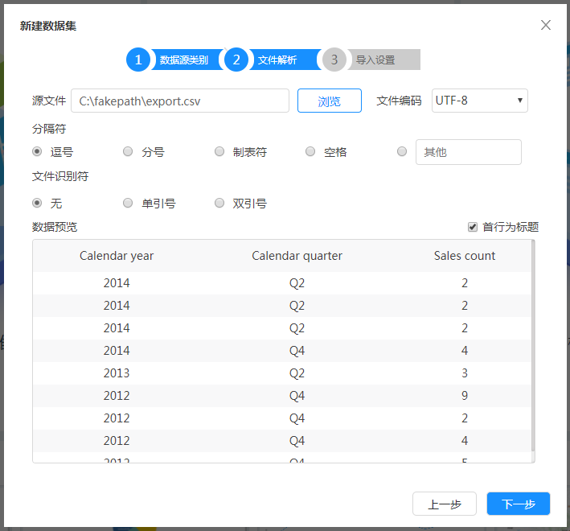

点击“下一步”，进入导入设置页面如图所示，用户可以选择需要导入服务器列并配置相关属性，可以指定数字和日期字段在源文件中的格式化文件。点击“完成”即可完成txt/csv文件数据的导入。

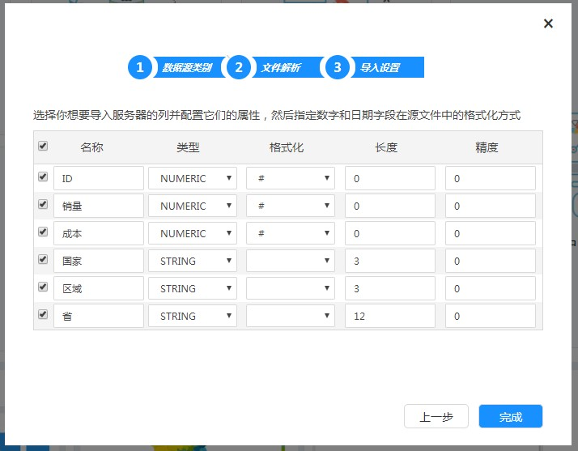

(2) 读取客户现有数据库

如果用户选择数据源连接类型为“新建数据源连接”，选择数据源类型，按照新建数据源链接的操作步骤完成操作。

如果用户选择数据源连接类型为“选择已有连接”，窗口更改为如图所示。用户输入数据源名称，并选择系统中的已有数据源链接，点击“下一步”。

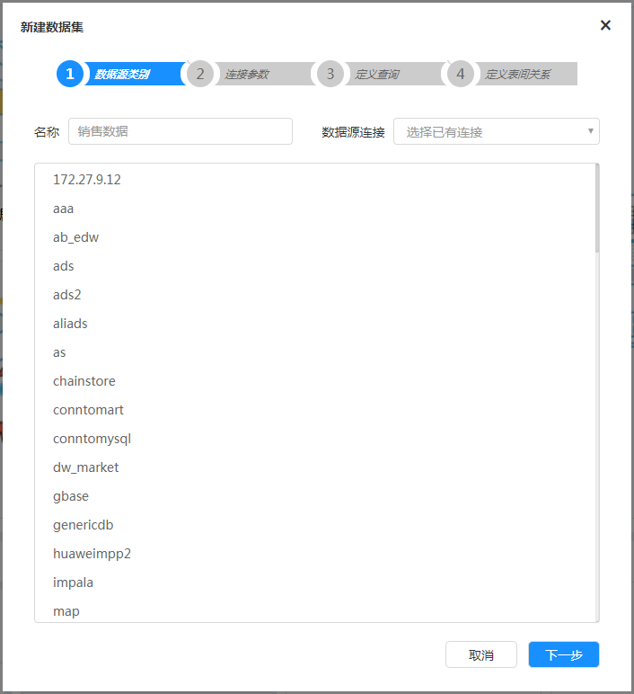

用户选择类别有两类：数据库表和自定义SQL查询语言。如果选择类别为“数据库表”，列表中将列出源数据库模式下的所有表，并选择一张或多张需要查询的表。如果指定一张表为事实表，将创建多维数据集，同时创建业务数据集。如果不指定事实表，则只创建业务数据集。目前只支持创建星形的多维数据集，不支持雪花模型。如图所示。

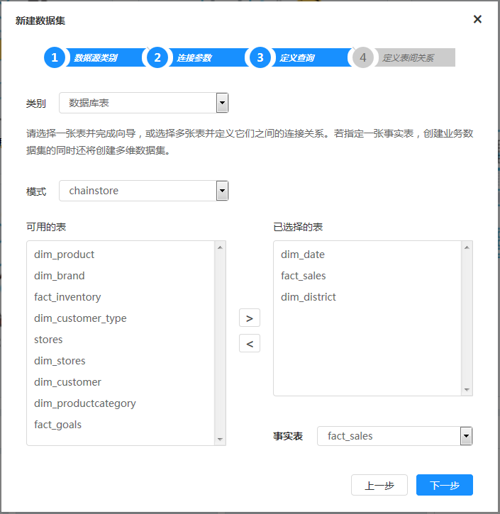

点击“下一步”，开始定义表间的连接，为左表和右表选择关联的字段并点击“创建连接”，即可生成如图所示连接。左侧事实表需与所有其它表创建连接关系，所有连接创建完成以后，点击“完成”按钮，即成功创建数据集。

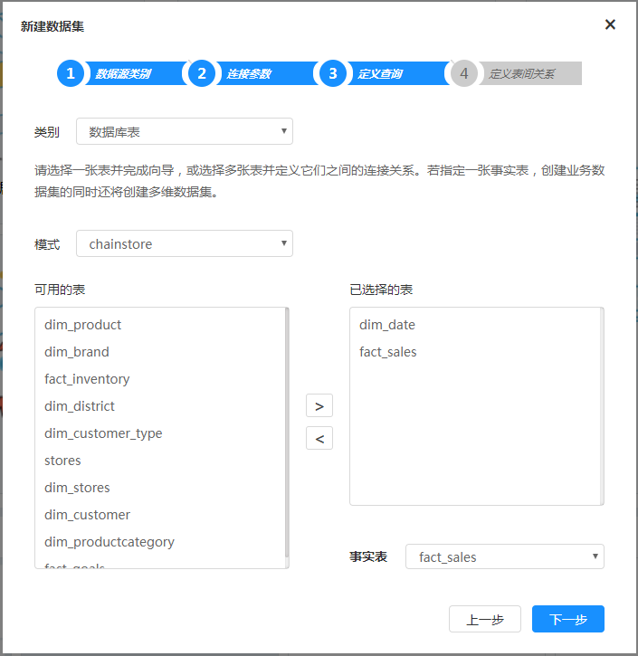

如果用户选择类别为“自定义SQL语句查询”，用户需要在窗口下方输入SQL语句，点击“完成”按钮，也可以完成数据集的创建，如图所示。

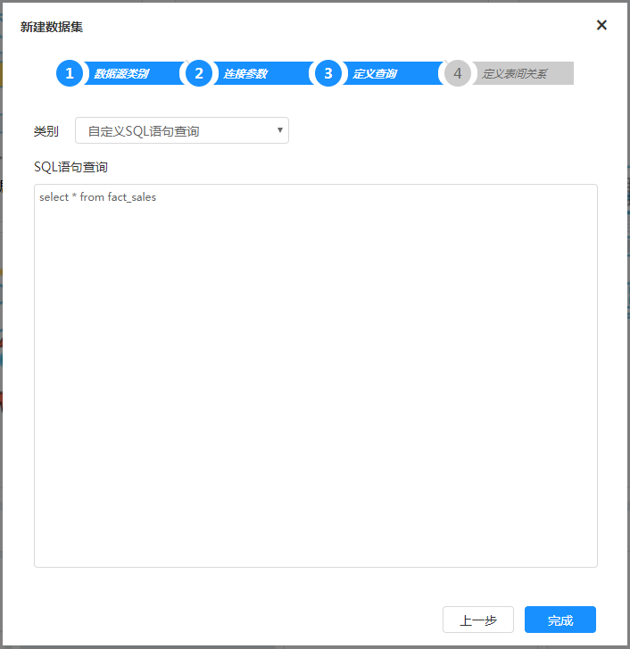

###  编辑数据集

数据集创建成功后，用户可以编辑数据集，使数据集更加贴近业务，对数据分析人员更加友好。

（1）数据集编辑器

当新建数据集向导完成时，数据集即创建成功，系统将弹出如图所示提示框：

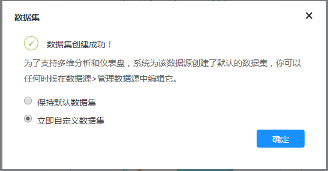

选择立即自定义数据集，可打开“数据集编辑器”。也可点击主菜单 =>数据源=>管理数据源，打开“管理数据源”对话框，如下图：

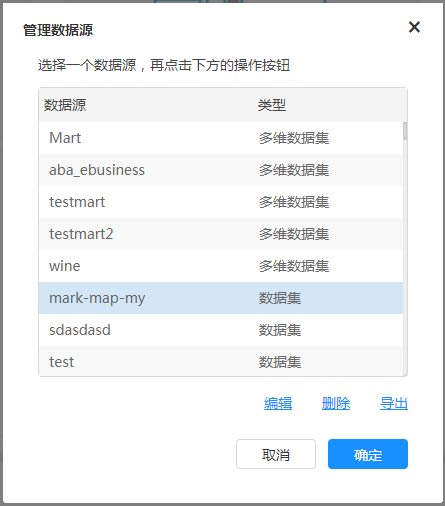

选择一个“数据集”类型的数据源，点击“编辑”连接打开“数据集编辑器”窗口。如图所示：

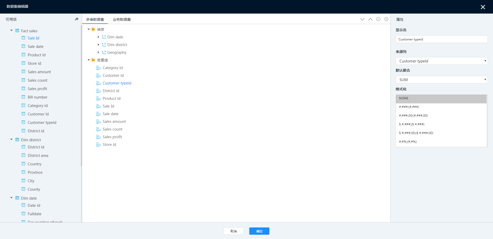

数据集编辑器界面主要分为三个部分：

● 左侧部分显示数据来源，以一个或多个二维表的形式展示，每个表可能是数据库中的实体表，也可能是使用SQL语句查询而来的虚拟表。

● 中间部分为多维数据集和业务数据集的结构。其中，多维数据集分为维度和度量值两大项目，可以对度量值和维度层次结构进行修改；业务数据集中为字段分组。

● 右侧为属性面板，显示中间部分选择项目的属性，可以对属性进行修改。

#### 编辑多维数据集

1）添加维度

添加维度有两种方法，一是通过使用添加维度按钮添加，另一种是通过拖动方式来添加。

鼠标指向顶级维度项目，维度旁将出现“添加“按钮”，如下图：

点击该按钮，弹出“添加维度”对话框，输入维度名称即可创建一个维度，如下图：

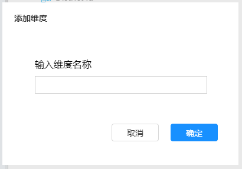

1. 鼠标指向刚添加的维度，点击旁边的添加按钮添加一个“层级”。

2. 同样的方法，点击层级旁的添加按钮添加一个“级别”。

3. 选择添加的级别，在右侧属性面板中选择一个来源列（即来自数据来源表的哪个列）。

4. 同上一步，可在一个层级下添加多个级别，多个级别从上到下的顺序，表示维度的层次结构。

创建完成后的维度结构如下：

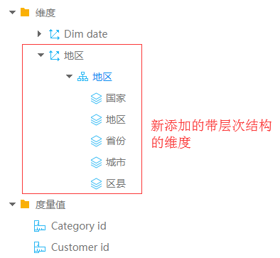

使用拖动的方式创建维度显示更为简单，将左侧维度表中的列拖动到中间维度项目上即可创建包含了一个级别的维度，再拖动其它列到该维度下组合成带层次结构的维度。如下图所示：

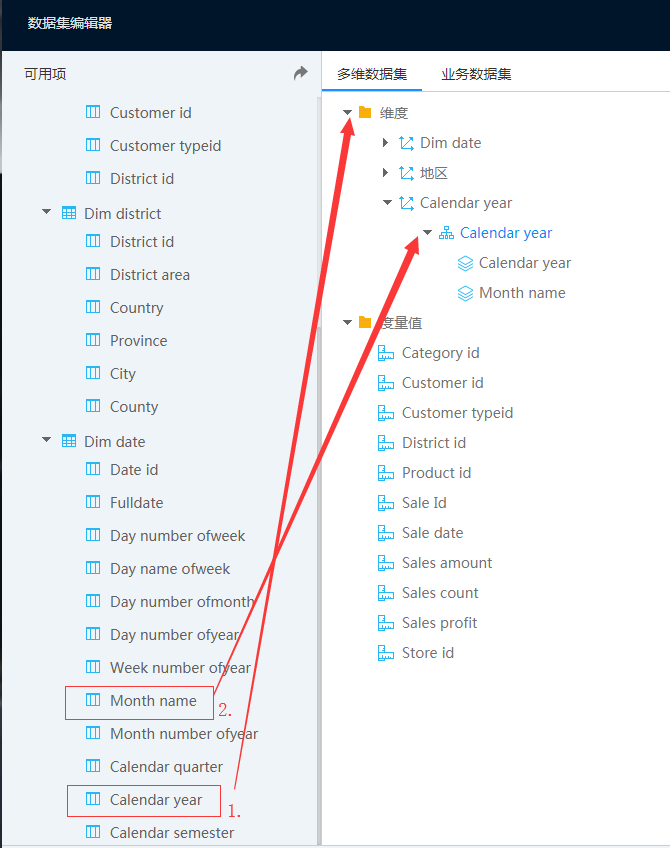

点击选择一个维度项目，再点击按钮可以删除不需要的项目，使用按钮改变维度级别的顺序。也可以在右侧属性面板中半名称改为中文，以便对数据分析人员更加友好。

2）添加度量值

同添加维度的方式一样，可以使用“添加”按钮来创建度量值，也可以采用拖动方式来创建度量值。注意只能使用事实表里的列来创建度量值。

编辑完成之后，点击“确定”保存数据集。新保存的数据集即可在多维分析以及仪表盘当中使用。

#### 编辑业务数据集

1）添加分组

将鼠标移至“所有分组”文件夹上，其右侧将出现“添加”按钮，点击该按钮弹出“添加分组”弹窗，如下图。输入分组名称即可创建一个分组，注意分组不可嵌套。其他操作如删除、调整顺序等操作，同多维数据集中对维度的操作。

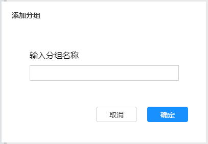

2）添加字段

同添加分组的方式一样，可以使用“添加”按钮来添加字段，也可以采用拖动方式来添加。编辑完成之后，点击“确定”保存数据集。新保存的数据集即可在多维分析以及仪表盘当中使用。

### 导入数据集

导入数据集功能，可以将本地硬盘中的数据集导入到平台之中。点击“导入数据集”，弹出如图所示窗口。数据集类型包括多维数据集和业务数据集两种。用户需要选择数据集类型、导入数据集文件及数据连接。

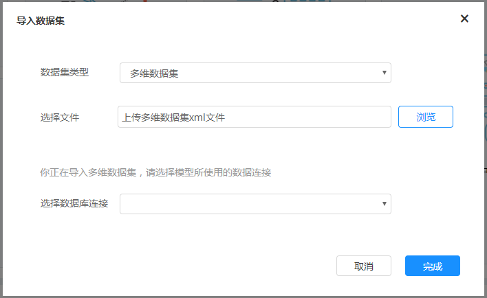

若选择“多维数据集”，点击“浏览”选择需要导入的数据集文件和数据库连接，即可完成数据集导入。

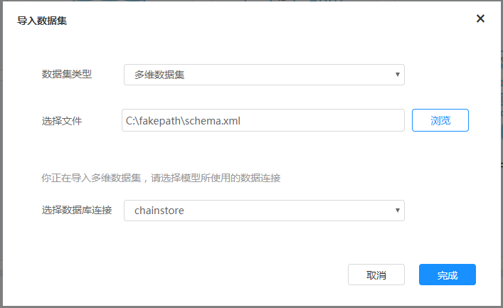

若选择“关系数据集”，点击“浏览”选择需要导入的数据集文件和设置一个域ID，即可完成数据集导入。

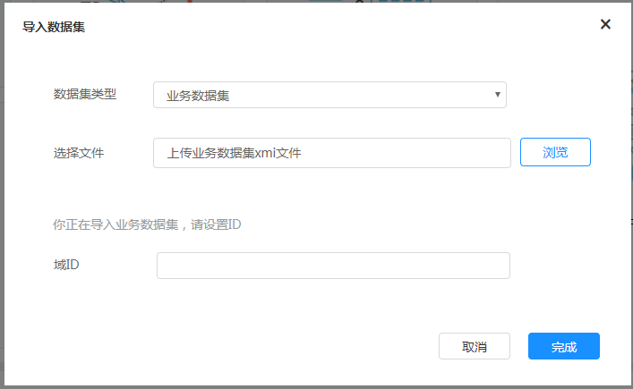

### 管理数据源

点击“管理数据源”，弹出如图所示窗口。可以对现有数据源进行“编辑”、“删除”和“导出”（JDBC数据源不支持导出）。

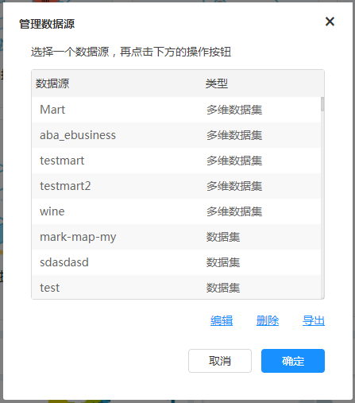

选择“多维数据集”类型的数据源，点击“编辑”，弹出对话框可修改多维数据集所使用的数据库连接。选择“数据集”类型的数据源，弹出“数据集编辑器”，如图所示。

无法编辑业务数据集，点击“编辑”按钮时，将弹出不可编辑的提示，如图所示。

选择JDBC类型的数据源，点击“编辑”，弹出编辑数据源连接对话框，可以对数据库连接参数进行修改，如图所示。

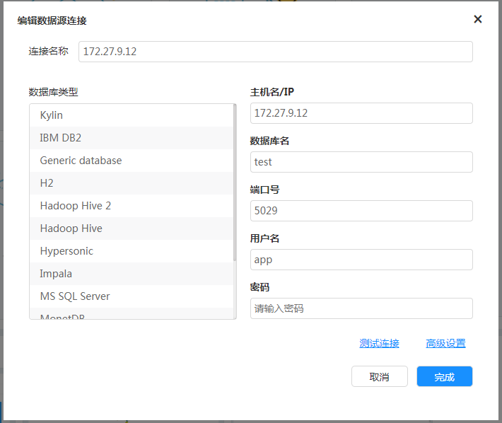

选择任意一种数据源，点击“删除”，弹出如图所示窗口，如果确定删除，点击“删除”按钮，完成数据源删除。如果不需要删除，点击“取消”，返回原窗口。

用户选择一个数据源，点击“导出”，弹出如图所示窗口，用户可以选择直接打开或者保存文件完成数据源的导出保存到本地。目前不支持JDBC数据库连接的导出。

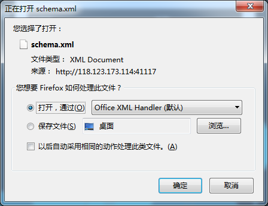
