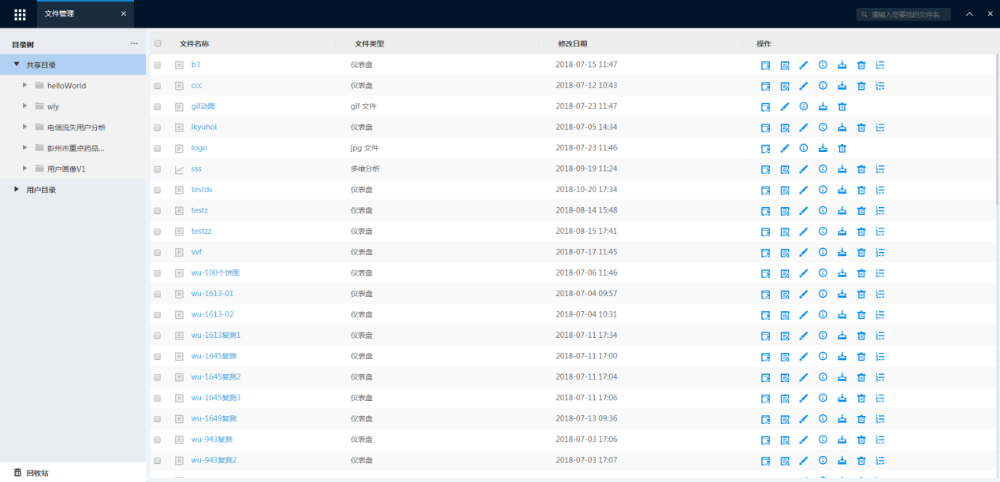
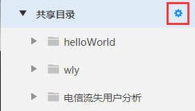
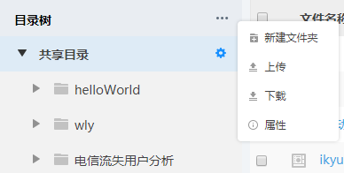
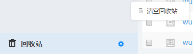
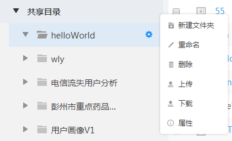
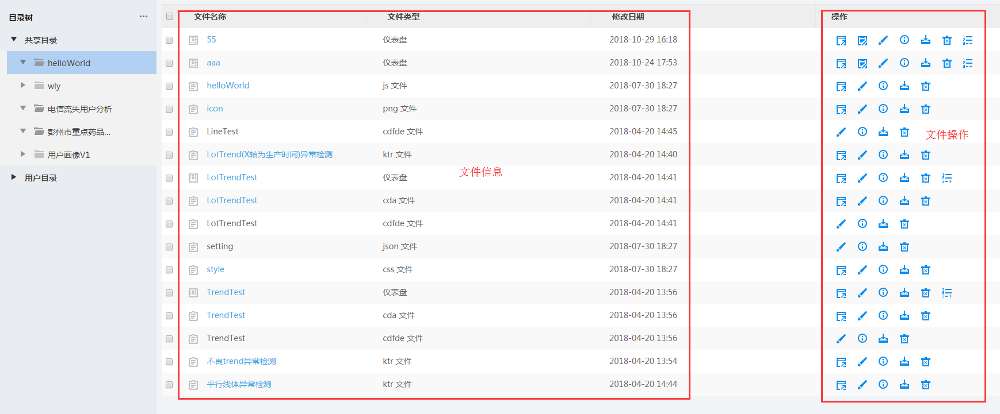
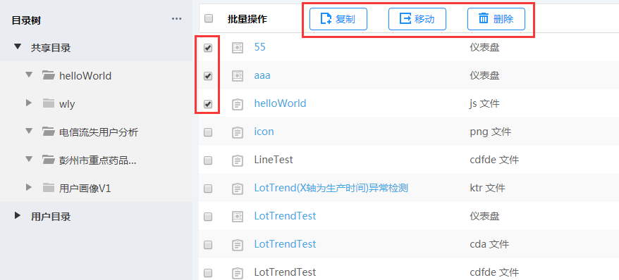
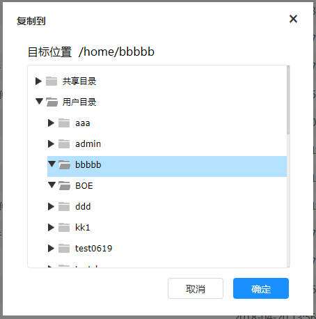

# 文件管理

在导航菜单中点击“文件管理”

文件管理有3个根目录：共享目录（所有拥有阅读权限的用户都可以看到的目录）、用户目录（用户自己的目录）、回收站（用户已删除的文件）。将鼠标移至其中一个目录上，会出现一个小图标如图

点击该图标弹出下拉框，可以新建文件夹、上传和下载文件，也可以查看该文件夹的属性，如图3.8-3所示。“回收站”只有一个操作，即“清空回收站”，如图

点击根目录下面的文件夹，与根目录相比多出一个重命名操作，可以对该目录进行重命名

点击根目录下面的文件夹或者直接点击“回收站”，在右侧展开文件及文件操作按钮，如图

将鼠标移至这些操作按钮即可出现该操作注释，分别表示：新窗口打开、编辑、重命名、属性、下载、删除、计划。若是回收站的文件，操作只有两个：恢复和彻底删除。如果文件类型名显示为蓝色，则可以直接点击文件名进入文件浏览。
要对一个目录中的文件进行批量复制、移动和删除操作，在需要操作的文件名前的框中打勾，上方出现操作按钮，点击弹出相应的操作框，并按提示操作，见图

