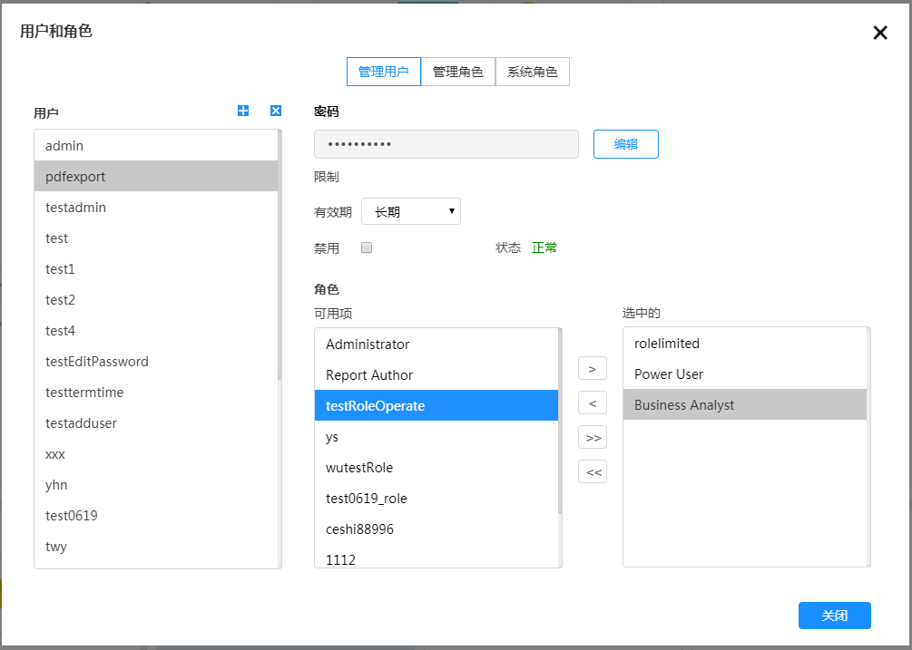

# 权限管理

xDataInsight平台可以对用户、角色和权限进行有效的管理和控制，以达到使用者对用户类别、用户密码以及用户权限的管理。

### 管理用户

在导航菜单上点击“设置”下面的“用户和角色”，弹出权限管理页面，如图

点击可以增加/删除用户，现增加一个用户，弹出窗口如下图所示，填入用户名和密码。在用户界面可以为该用户设置有效期或者对用户进行禁用来控制用户权限

可以在“角色”栏选择已有角色进行权限分配，如图

### 管理角色

管理角色界面如图

点击可以增加/删除角色，若增加一个角色，弹出窗口如图所示，填入用户名

角色建好以后，为角色分配操作权限和用户，如图

### 系统角色

系统角色界面如图 

其中：Authenticated为所有用户的默认最低权限。