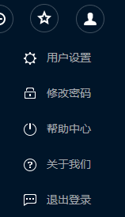
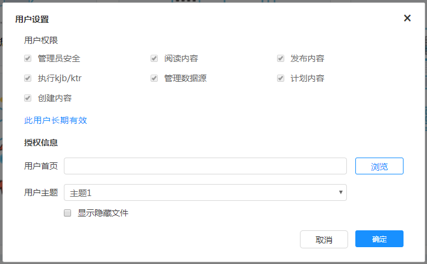
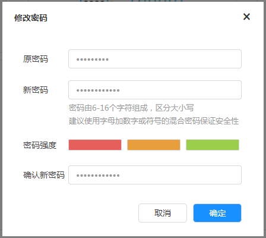

# 用户中心

xDataInsight平台用户中心支持用户设置主题、用户首页、显示用户拥有的权限、修改密码等功能，也可从相关网页了解产品其他信息。点击页面右上角图标，弹出菜单如图

点击“用户设置”，弹出如下图所示的窗口，可以分别对用户权限、首页、主题、是否显示隐藏文件进行设置

点击“修改密码”，弹出如下图所示弹出框，进行新密码的设置

除此之外，用户中心的功能还包括：退出登录、帮助中心、关于我们和用户引导
