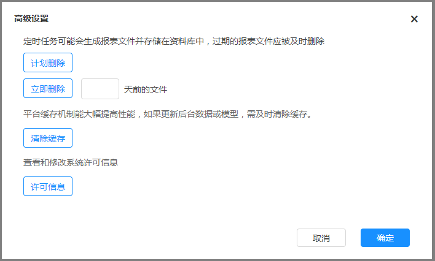
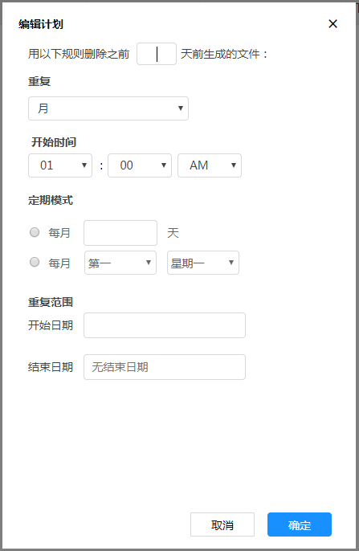

# 高级设置

### 管理临时文件

定时任务会生成临时文件并存储在资料库中，为避免临时文件占距大量的存储空间，应定期清理临时文件。
在导航菜单中点击“设置”下的“高级设置”，弹出如图

点击“计划删除”，开始编辑计划，如图

编辑文件的删除计划，然后保存，即可在满足计划规则时，对过期报表文件进行清理。如果点击“立即删除”，需要先指定一个删除的时间点，如删除10天前的文件

### 平台缓存

xDataInsight平台拥有数据缓存机制，该机制能大幅提高平台性能。资源文件、数据集、数据存取等方面都有相应缓存空间，如果更新了后台数据或数据集，需及时清除缓存使最新的数据能够及时生效
