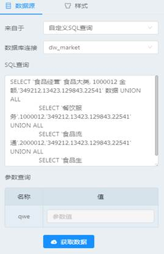
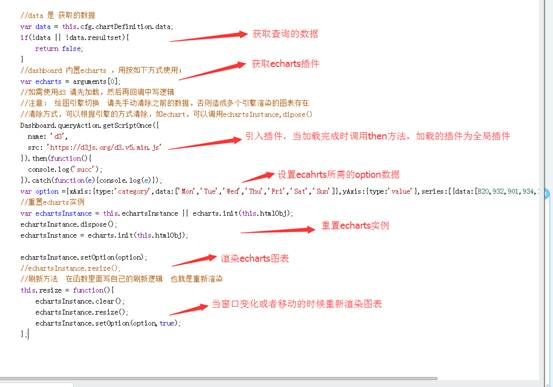

# 自定义图表

## 自定义图表介绍

自定义图表为自己代码实现方式的组件，相当于 dashboard 的扩展接口组件，可实现各种图标，如水球图，折线图饼图的混合图等，并且提供接入数据功能，可与其他组件形成联动与被联动关系。

## 自定义图表能做什么

当仪表盘内置图表组件或者内置组件的展示方式不符合需求的时候，可根据需要按照开发手册写出自己想要的图表，并且实现想要的图表逻辑和展示方式。

## 如何开发一个图表

1、打开 dashboard 界面，拖拽左边自定义图表组件进入中间画布区域。


2、选中画布区域的自定义组件。

3、在组件左边根据需要配置数据源(可以不配置)

4、定义数据源，并且点击获取数据按钮，(ps:缓存数据查询)。如不需要绑定数据，可不用填写。



5、切换到样式选项，查看或者编写自定义代码。下面是一个自定义折线图的代码解析



6、点击立即执行（重要），此时代码运行并且代码保存到数据中；

## 案例：水球图


在当前选中的自定义图表的自定义代码中写入

a) 如需获取数据，则加入获取数据代码

```javascript
//data 是获取的数据
var data = this.cfg.chartDefinition.data;
if(!data || !data.resultset){
return false;
}
```

b) 获取当前的 echarts 插件并且设置为全局属性(因为引入的水球图插件需要使用全局的 echarts 对象)

```javascript
//dashboard内置echarts，用按如下方式使用：
var echarts = arguments[0];
window.echarts = echarts;
```

c) 引入水球图的插件，并保存在变量 one 中

```javascript
//引入水球图插件
var one = Dashboard.queryAction.getScriptOne({
    name:"liquidfill",
    src:'http://echarts.baidu.com/resource/echarts-liquidfill-1.0.4/dist/echarts-liquidfill.js'
});
```

d) 重置 echarts 实例

```javascript
var echartsInstance = this.echartsInstance || echarts.init(this.htmlObj);
echartsInstance.dispose();
echartsInstance = echarts.init(this.htmlObj);
```

e) 定义 echarts 所需 option

```javascript
var option = {
    series:[{
        type:'liquidFill',
        radius:'80%',
        data:[0.5,0.45,0.4,0.3],
        label:{
            normal:{
                textStyle:{
                    color:'red',
                    insideColor:'yellow',
                    fontSize:50
                }
            }
        }
    }]
}
```

f) 当插件加载完成时就渲染图表

```javascript
one.then(function(){
    echartsInstance.setOption(option);
});
```

g) 编写 resize 代码

```javascript
this.resize = function(){
    echartsInstance.clear();
    echartsInstance.resize();
    echartsInstance.setOption(option);
}
```

## 案例代码

```javascript
//data 是 获取的数据

var data = this.cfg.chartDefinition.data;

if (!data || !data.resultset) {

    return false;

}

//dashboard 内置echarts ，用按如下方式使用；

var echarts = arguments[0];

window.echarts = echarts;

//引入水球图插件

var one = Dashboard.queryAction.getScriptOnce({

    name: 'liquidfill',

    src: 'http://echarts.baidu.com/resource/echarts-liquidfill-1.0.4/dist/echarts-liquidfill.js'

});

var option = {

    series: [{

        type: 'liquidFill',

        radius: '80%',

        data: [0.5, 0.45, 0.4, 0.3],

        label: {

            normal: {

                textStyle: {

                    color: 'red',

                    insideColor: 'yellow',

                    fontSize: 50

                }

            }

        }

    }]

};

var echartsInstance = this.echartsInstance || echarts.init(this.htmlObj);

echartsInstance.dispose();

echartsInstance = echarts.init(this.htmlObj);


this.resize = function() {

    echartsInstance.clear();

    echartsInstance.resize();

    echartsInstance.setOption(option);

};

one.then(function(){

    echartsInstance.setOption(option);

});
```
